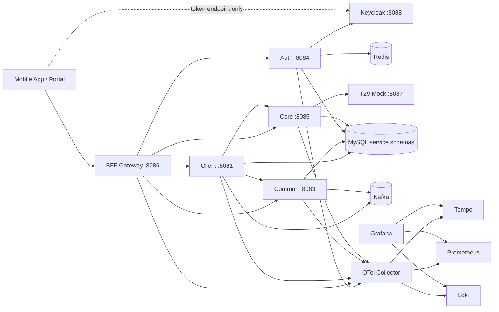
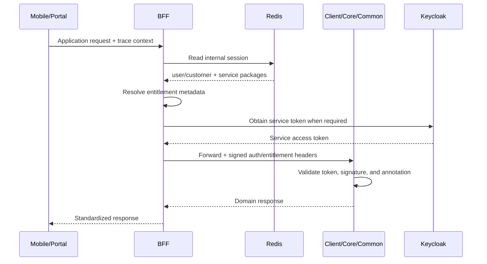
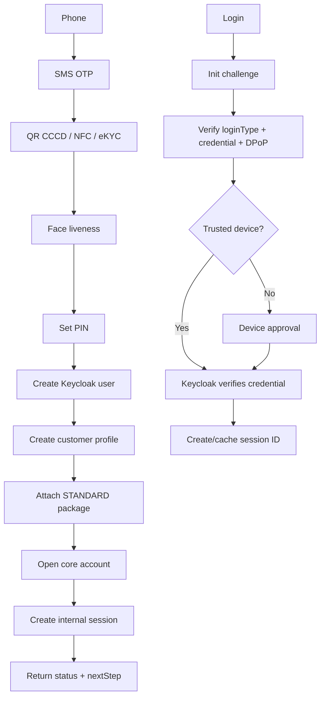
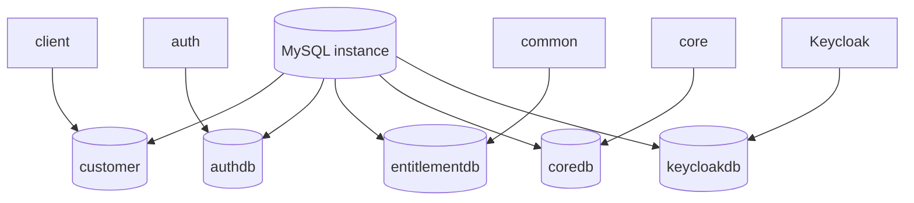

# TruongSonBank

TruongSonBank is a banking platform reference/demo organized around
microservices, hexagonal architecture, and production-like infrastructure. The
repository contains backend services, a shared platform package, a native iOS
application, an operations portal, and local observability infrastructure.

> This repository is for development and testing. Secrets, the Keycloak realm,
> T29, and several third-party providers are local/demo implementations and are
> not production-ready defaults.

## Contents

- [Project Scope](#project-scope)
- [Modules](#modules)
- [General Architecture](#general-architecture)
- [Code Architecture](#code-architecture)
- [Database Architecture](#database-architecture)
- [Key Concepts](#key-concepts)
- [Prerequisites](#prerequisites)
- [Running the System](#running-the-system)
- [Portal and Mobile App](#portal-and-mobile-app)
- [Smoke Tests and Observability](#smoke-tests-and-observability)
- [Development and Testing](#development-and-testing)
- [Limitations and Troubleshooting](#limitations-and-troubleshooting)
- [Detailed Documentation](#detailed-documentation)

## Project Scope

The platform demonstrates:

- customer onboarding, OTP, eKYC/NFC/liveness, and account opening;
- PIN/password, biometric/passkey login, DPoP, challenge/nonce, and trusted devices;
- internal sessions, BFF gateway routing, and service-to-service authorization;
- customer entitlement through service packages, groups, and operations;
- account and balance boundaries through the core account service;
- configuration management with draft, publish, version, audit, and cache;
- Kafka retry, idempotency, outbox, DLQ, replay, and trace propagation;
- L1/L2 cache, multi-instance invalidation, sequence generation, encryption, and sharding;
- centralized logs, distributed traces, and metrics.

## Modules

| Module | Responsibility |
| --- | --- |
| `sharedpackage` | Spring Boot starter for response, exception, validation, logging, OpenTelemetry, cache, Kafka, HTTP/gRPC clients, resilience, service tokens, sequences, crypto, and sharding. |
| `bff` | Public gateway for mobile and portal clients. Reads Redis sessions, enriches entitlement, obtains service tokens, and routes requests without owning business logic. |
| `auth` | Keycloak integration, challenge/nonce, DPoP, login types, trusted devices, internal sessions, and Keycloak-subject/customer mapping. |
| `client` | Customer domain: onboarding, customer profiles, config client, protocol/cache/Kafka demos, and account-opening orchestration. |
| `core` | Core account boundary for account creation, lookup, balance, and account operations. |
| `common` | Modular monolith for configuration management, entitlement, and mock third-party providers. It can later be split into microservices. |
| `t29` | T24-like in-memory mock core for account number generation and account operations. |
| `keycloak-biometric-provider` | Custom Keycloak provider for biometric/passkey credentials and custom grants. |
| `mobileapp` | Native SwiftUI iOS application for onboarding, login, and API-log inspection. |
| `portal` | Plain HTML/CSS/JS operations portal for configuration and entitlement management through BFF. |
| `deployment` | Docker Compose, MySQL initialization/migrations, and local infrastructure configuration. |
| `monitoring` | Prometheus, Grafana, Tempo, Loki, OpenTelemetry Collector, and Promtail. |
| `plan` | Design, brainstorming, database, flow, and implementation documents. |

### Default ports

| Component | Host port |
| --- | ---: |
| BFF | `8086` |
| Client | `8081` |
| Auth | `8084` |
| Common | `8083` |
| Core | `8085` |
| T29 | `8087` |
| Keycloak | `8088` |
| MySQL / Redis / Kafka | `3306` / `6379` / `19092` |
| Kafka UI / Consul | `18080` / `8500` |
| Prometheus / Grafana | `9090` / `3000` |
| Tempo / Loki / RedisInsight | `3200` / `3100` / `5540` |

`client2` is an optional demo service and is currently not part of the main
Compose stack.

## General Architecture

The Mermaid diagrams below are rendered directly by GitHub as architecture
diagrams.

### Runtime architecture



### Trust boundary and request flow



### Onboarding and login



## Code Architecture

Backend domains use hexagonal architecture so each domain can later become a
separate repository or microservice:

```text
<service>/src/main/java/vn/com/truongsonbank/<service>/
├── <domain-context>/
│   ├── domain/
│   │   ├── model/
│   │   └── port/{in,out}/
│   ├── application/service/
│   ├── adapter/in/web/
│   └── infrastructure/
│       ├── persistence/
│       ├── keycloak/
│       ├── messaging/
│       └── configuration/
└── <service>Application.java
```

Main contexts include:

- `client/customer`: onboarding and customer profile;
- `core/account`: account opening, detail, and balance;
- `common/config`: configuration draft/publish/version/audit;
- `common/entitlement`: operations, groups, packages, and assignments;
- `auth/authentication`: login, challenge, session, and trusted devices;
- `bff`: gateway filters and context enrichment, with no business domain ownership.

`sharedpackage` is a Spring Boot starter. Services import the dependency and
configure `application.yml`; auto-configuration provides response handling,
exceptions, tracing, logging, metrics, cache, Kafka, HTTP/gRPC, resilience, and
security interceptors.

## Database Architecture

Each domain owns its own schema. Sharing one local MySQL instance does not grant
services permission to read another domain's tables.



| Schema | Owner | Main data |
| --- | --- | --- |
| `customer` | `client` | `customer_profile`, onboarding sessions, account links, and outbox data. |
| `authdb` | `auth` | `auth_customer_identity`, `auth_device`, and `auth_session`. Biometric/passkey/PIN credentials belong to the Keycloak provider. |
| `entitlementdb` | `common` | Configuration draft/publish/audit; operations, groups, service packages, assignments, overrides, and snapshots. |
| `coredb` | `core` | Core customer mapping, `core_account`, and idempotency/account-operation records. |
| `keycloakdb` | Keycloak | Realm, user, credential, and provider-managed identity data. |

`commondb` is legacy. Common must use `entitlementdb`; the migration is in
`deployment/mysql/migrations/`.

## Key Concepts

### Authentication and sessions

- Keycloak authenticates credentials and manages users and credentials.
- Auth validates DPoP, challenge/nonce, and trusted-device state before creating
  an internal session ID.
- Sessions are stored in Redis so BFF can read them without calling Auth on every
  request.
- A user can have multiple trusted devices; each device has its own key pair and
  DPoP JKT.
- Login is distinguished by `loginType`: `tsb-pin`, `password`,
  `biometric`, or `passkey`.

### Authorization

- Customers are assigned service packages; staff/system principals may use roles.
- A package contains groups; groups support parent/child relationships and map to
  independent operations such as `TRANSFER` and `TRANSFER_GLOBAL`.
- BFF resolves operations and forwards a signed context to the domain.
- Domains use `@RequireEntitlement` and service-permission validators.
- Service-to-service calls use service tokens; a plain-text entitlement header is
  not a security proof.

### Resilience and protocols

Shared HTTP/gRPC clients support timeout, retry/backoff, `Retry-After` for 429,
circuit breaker, fallback, deadline, TLS, tracing, metrics, and service-token
interceptors.

### Kafka

Producers and consumers provide trace propagation and metrics. Idempotency
prevents duplicate processing, retries use backoff, failed messages go to DLQ,
replay is explicit, and outbox events are relayed to Kafka after the domain
transaction.

### Observability

OpenTelemetry propagates traces over HTTP, gRPC, and Kafka. JSON logs include
`app`, `traceId`, `spanId`, request metadata, and error stacktraces.
Promtail sends logs to Loki; the OTel Collector sends traces/metrics to Tempo
and Prometheus; Grafana visualizes all three.

### Configuration and cache

Common configuration supports draft, validation, publish, version, audit, and
rollback. Client pulls configuration at startup, keeps an L1 cache, polls for
changes, and receives real-time updates through Redis pub/sub/tracking. The cache
platform supports L1/L2, soft TTL, null TTL, broadcast invalidation, and metrics.

## Prerequisites

- Docker Desktop or Colima with at least 6-8 GB RAM for the local stack.
- Docker Compose v2, JDK 25, Maven 3.9+, and Git.
- Python 3 for the portal.
- Xcode and an Apple Development Team for a physical iPhone build.

Dependency versions are managed in each `pom.xml`. Do not commit tokens,
private keys, keystores, or real `.env` files.

## Running the System

```bash
cd /Users/sonnvt/sonnvt/TruongSonBank

docker compose -f deployment/docker-compose.monitoring.yml up -d --build
docker compose -f deployment/docker-compose.monitoring.yml ps
```

Rebuild and restart the main services:

```bash
docker compose -f deployment/docker-compose.monitoring.yml up -d \
  --build --force-recreate auth bff client common core
```

Stop the stack:

```bash
docker compose -f deployment/docker-compose.monitoring.yml down
```

Do not use `down -v` if you want to keep MySQL, Redis, and monitoring volumes.

### Build individual modules

```bash
cd sharedpackage && mvn -q test install
cd ../auth && mvn -q -DskipTests package
cd ../bff && mvn -q -DskipTests package
cd ../client && mvn -q -DskipTests package
cd ../common && mvn -q -DskipTests package
cd ../core && mvn -q -DskipTests package
```

After changing sharedpackage, install it into the local Maven repository before
packaging services that consume the new version.

Compose creates base schemas from
`deployment/mysql/init/00-create-service-schemas.sql`; additional migrations
are in `deployment/mysql/migrations/`. Production should use a dedicated
Flyway/Liquibase migration job.

## Portal and Mobile App

### Operations portal

```bash
cd portal
python3 -m http.server 8090
```

Open http://localhost:8090. The portal calls BFF at
`http://localhost:8086/bff/api/common`; the local demo admin key is
`local-admin-key`.

### Native iOS app

Open `mobileapp/TruongSonBankMobile.xcodeproj` in Xcode. Use `localhost` for
the simulator; use the Mac LAN IP for BFF/Keycloak on a physical iPhone. Put
local configuration in the env file described by
`mobileapp/VnptSdk.env.example`; do not commit real env values.

NFC Scan and Face ID require capabilities and a provisioning profile supported by
the Apple Development Team. QR/eKYC/liveness third-party flows can use the mock
provider when the required SDK or license is unavailable.

## Smoke Tests and Observability

```bash
curl -i http://localhost:8086/bff/api/actuator/health
curl -i http://localhost:8083/common/api/actuator/health
curl -i http://localhost:8081/actuator/health
```

Inspect containers and logs:

```bash
docker compose -f deployment/docker-compose.monitoring.yml ps
docker logs -f tsb-bff
docker logs -f tsb-auth
docker logs -f tsb-client
docker logs -f tsb-common
docker logs -f tsb-core
```

### Infrastructure UIs

- Grafana: http://localhost:3000
- Kafka UI: http://localhost:18080
- RedisInsight: http://localhost:5540
- Prometheus: http://localhost:9090
- Tempo API: http://localhost:3200
- Loki API: http://localhost:3100
- Consul: http://localhost:8500
- Keycloak: http://localhost:8088

Common Swagger URLs:

- Auth: `http://localhost:8084/auth/api/swagger-ui/index.html`
- Common: `http://localhost:8083/common/api/swagger-ui/index.html`
- Core: `http://localhost:8085/core/api/swagger-ui/index.html`
- Client: `http://localhost:8081/swagger-ui/index.html`

## Development and Testing

```bash
cd sharedpackage && mvn -q test
cd ../auth && mvn -q test
cd ../bff && mvn -q test
cd ../client && mvn -q test
cd ../common && mvn -q test
cd ../core && mvn -q test

docker compose -f deployment/docker-compose.monitoring.yml config -q
```

When adding a service: follow the hexagonal convention, import sharedpackage,
create a dedicated schema, add health/metrics/tracing/logging/discovery, update
Compose or deployment manifests, add a BFF route for public APIs, add migrations,
and add smoke tests.

## Limitations and Troubleshooting

- T29 is an in-memory mock. SMS, NFC, eKYC, liveness, and some third-party
  adapters are mocked or depend on external SDKs/licenses.
- Local Keycloak, secrets, TLS, Kafka security, and database credentials are for
  development only. Local Compose does not provide HA, autoscaling, KMS, WAF, or
  a service mesh.
- `client2` is optional and is not part of the default Compose stack.
- Production requires a secret manager/KMS, TLS/mTLS, HA Keycloak, migration jobs,
  Kafka ACL/SASL/TLS, Redis HA, backup/restore, rate limiting, a risk engine,
  security/load testing, and disaster recovery.

For OOM or startup failures:

```bash
docker compose -f deployment/docker-compose.monitoring.yml ps
docker compose -f deployment/docker-compose.monitoring.yml logs --tail=200 <service>
```

If new code is not present in a container:

```bash
docker compose -f deployment/docker-compose.monitoring.yml up -d \
  --build --force-recreate <service>
```

If the mobile app cannot reach the backend, do not use `localhost` on a physical
iPhone. Use the Mac LAN IP, the same network, and an open firewall port. If NFC
build fails, use an Apple Team/profile with NFC support or the QR/mock provider.

If traces or logs are missing, check OTel Collector, Tempo, Loki, Grafana,
`OTEL_EXPORTER_OTLP_ENDPOINT`, and `TSB_SHARED_TRACING_*`. Actuator/health
endpoints may be excluded to avoid noisy traces and logs.

## Detailed Documentation

Design and implementation plans are in [plan](plan/):

- [architecture-flow-db-brainstorm.md](plan/architecture-flow-db-brainstorm.md)
- [auth-like-prod-implementation-plan.md](plan/auth-like-prod-implementation-plan.md)
- [auth-login-challenge-flow-design.md](plan/auth-login-challenge-flow-design.md)
- [bff-layer-design.md](plan/bff-layer-design.md)
- [client-onboarding-design.md](plan/client-onboarding-design.md)
- [common-config-management-design.md](plan/common-config-management-design.md)
- [core-account-implementation-plan.md](plan/core-account-implementation-plan.md)
- [entitlement-design.md](plan/entitlement-design.md)
- [entitlement-enrichment-implementation-plan.md](plan/entitlement-enrichment-implementation-plan.md)
- [protocol-resilience-brainstorm.md](plan/protocol-resilience-brainstorm.md)
- [service-to-service-authorization-implementation-plan.md](plan/service-to-service-authorization-implementation-plan.md)
- [sharedpackage-starter-design.md](plan/sharedpackage-starter-design.md)
- [sharedpackage-sharding-design.md](plan/sharedpackage-sharding-design.md)

Keep this file and the Vietnamese README aligned when runtime behavior changes.

