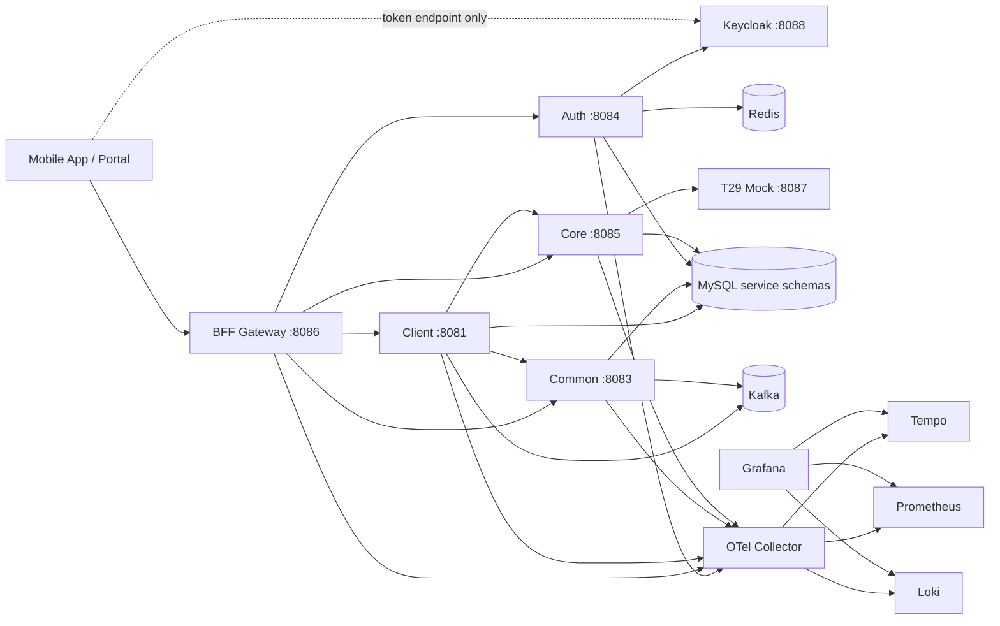
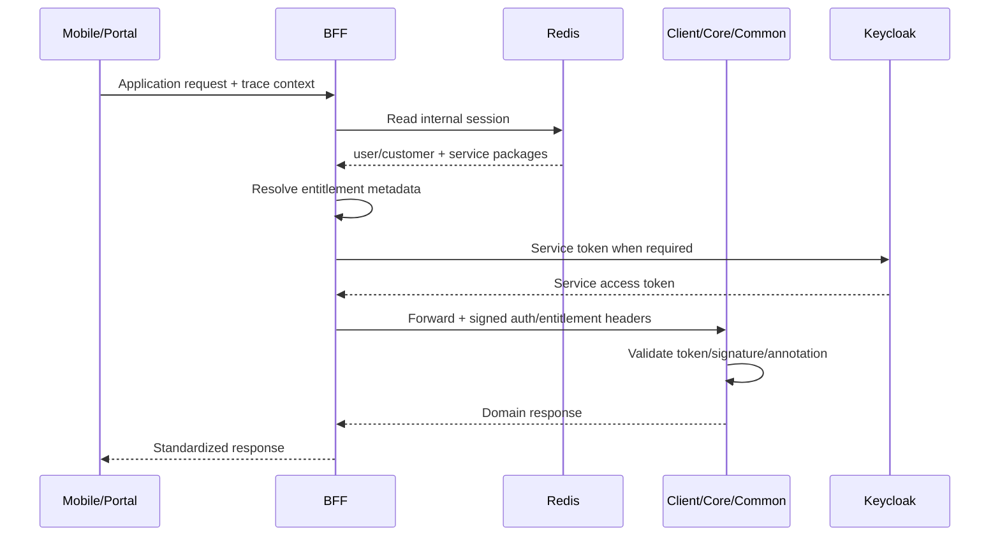
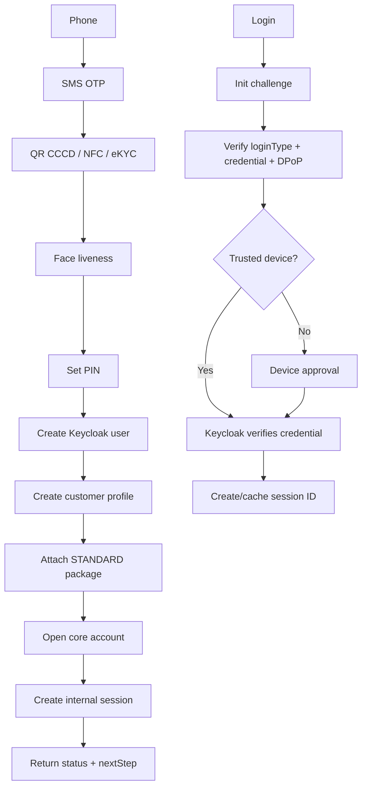
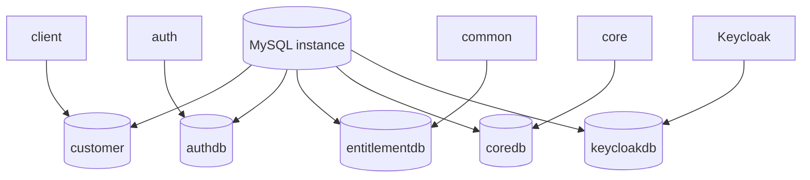
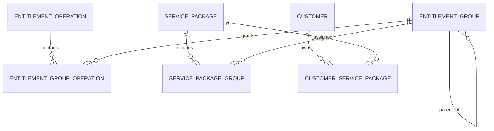

# TruongSonBank

TruongSonBank là một banking platform reference/demo theo hướng microservices,
hexagonal architecture và production-like infrastructure. Repo gồm backend
services, shared platform package, native iOS app, operations portal và hạ tầng
quan sát hệ thống.

[English version](README.md)

> Đây là môi trường phát triển và kiểm thử. Secret, Keycloak realm, T29 và một
> số third-party provider hiện là cấu hình/mock local, chưa phải production.

## Mục lục

- [Phạm vi dự án](#phạm-vi-dự-án)
- [Các module](#các-module)
- [Kiến trúc tổng quát](#kiến-trúc-tổng-quát)
- [Kiến trúc code](#kiến-trúc-code)
- [Kiến trúc database](#kiến-trúc-database)
- [Các concept chính](#các-concept-chính)
- [Prerequisites](#prerequisites)
- [Chạy hệ thống](#chạy-hệ-thống)
- [Portal và mobile app](#portal-và-mobile-app)
- [Smoke test và observability](#smoke-test-và-observability)
- [Phát triển và kiểm thử](#phát-triển-và-kiểm-thử)
- [Giới hạn và troubleshooting](#giới-hạn-và-troubleshooting)
- [Tài liệu chi tiết](#tài-liệu-chi-tiết)

## Phạm vi dự án

Hệ thống minh họa:

- onboarding khách hàng, OTP, eKYC/NFC/liveness và mở tài khoản;
- login PIN/password, biometric/passkey, DPoP, challenge/nonce và trusted device;
- internal session, BFF gateway và service-to-service authorization;
- entitlement theo customer, service package, group và operation;
- account/balance/transfer boundary qua core account;
- config management với draft, publish, version, audit và cache;
- Kafka retry, idempotency, outbox, DLQ, replay và trace propagation;
- cache L1/L2, invalidation đa instance, sequence, encryption và sharding;
- centralized logs, distributed traces và metrics.

## Các module

| Module | Vai trò |
| --- | --- |
| `sharedpackage` | Spring Boot starter: response, exception, validation, logging, OpenTelemetry, cache, Kafka, HTTP/gRPC client, resilience, service token, sequence, crypto và sharding. |
| `bff` | Public gateway cho mobile/portal; forward request, đọc Redis session, enrich entitlement, tạo service token và route tới domain; không chứa business logic. |
| `auth` | Keycloak integration, challenge/nonce, DPoP, login types, trusted device, internal session và mapping Keycloak subject với customer. |
| `client` | Customer domain: onboarding, customer profile, config client, protocol/cache/Kafka demo và orchestration mở tài khoản. |
| `core` | Core account boundary: tạo, tra cứu và xử lý account/balance. |
| `common` | Modular monolith cho config management, entitlement và mock third-party providers; có thể tách thành microservices. |
| `t29` | T24-like mock core, hiện dùng in-memory để mô phỏng tạo account và số account. |
| `keycloak-biometric-provider` | Custom Keycloak provider cho biometric/passkey credential và custom grant. |
| `mobileapp` | Native SwiftUI iOS app để thử onboarding, login và API logs. |
| `portal` | Plain HTML/CSS/JS operations portal quản lý config và entitlement qua BFF. |
| `deployment` | Docker Compose, MySQL init/migration và hạ tầng local. |
| `monitoring` | Prometheus, Grafana, Tempo, Loki, OTel Collector và Promtail. |
| `plan` | Design, brainstorm, database, flow và implementation plan. |

### Cổng mặc định

| Thành phần | Port |
| --- | ---: |
| BFF | `8086` |
| Client | `8081` |
| Auth | `8084` |
| Common | `8083` |
| Core | `8085` |
| T29 | `8087` |
| Keycloak | `8088` |
| MySQL / Redis / Kafka | `3306` / `6379` / `19092` |
| Kafka UI / Consul | `18080` / `8500` |
| Prometheus / Grafana | `9090` / `3000` |
| Tempo / Loki / RedisInsight | `3200` / `3100` / `5540` |

`client2` là service demo tùy chọn và hiện không thuộc compose chính.

## Kiến trúc tổng quát

Các sơ đồ Mermaid được GitHub render trực tiếp như ảnh kiến trúc.

### Runtime architecture



### Trust boundary và request flow



### Onboarding và login



## Kiến trúc code

Backend dùng hexagonal architecture để mỗi domain có thể tách thành repository
hoặc microservice sau này:

```text
<service>/src/main/java/vn/com/truongsonbank/<service>/
├── <domain-context>/
│   ├── domain/
│   │   ├── model/
│   │   └── port/{in,out}/
│   ├── application/service/
│   ├── adapter/in/web/
│   └── infrastructure/
│       ├── persistence/
│       ├── keycloak/
│       ├── messaging/
│       └── configuration/
└── <service>Application.java
```

Các context chính:

- `client/customer`: onboarding và customer profile;
- `core/account`: account open, detail, balance;
- `common/config`: config draft/publish/version/audit;
- `common/entitlement`: operation, group, package và assignment;
- `auth/authentication`: login, challenge, session và trusted device;
- `bff`: gateway filter/context enrichment, không sở hữu business domain.

`sharedpackage` là Spring Boot starter. Service import dependency và cấu hình
`application.yml`; auto-configuration cung cấp response, exception, trace, log,
metrics, cache, Kafka, HTTP/gRPC, resilience và security interceptor.

## Kiến trúc database

Mỗi domain sở hữu schema riêng. Cùng một MySQL instance local không có nghĩa
service được phép đọc bảng của domain khác.



| Schema | Owner | Dữ liệu chính |
| --- | --- | --- |
| `customer` | `client` | `customer_profile`, onboarding session, account link và outbox. |
| `authdb` | `auth` | `auth_customer_identity`, `auth_device`, `auth_session`. Biometric/passkey/PIN credential thuộc Keycloak provider. |
| `entitlementdb` | `common` | Config draft/publish/audit; operation, group, service package, assignment, override và snapshot. |
| `coredb` | `core` | Core customer mapping, `core_account` và idempotency/account operation. |
| `keycloakdb` | Keycloak | Realm, user, credential và provider data do Keycloak quản lý. |

`commondb` là legacy. Common hiện phải dùng `entitlementdb`; migration nằm
trong `deployment/mysql/migrations/`.

### Entitlement model



BFF cache metadata ở L1 theo package/group/operation; Redis session L2 chứa
package của user. Entitlement metadata đổi sẽ phát event để BFF invalid L1.
Thay package của user không sửa ngay session L2; user logout/login để lấy policy
mới hiện tại.

## Các concept chính

### Authentication và session

- Keycloak xác thực credential và quản lý user/credential.
- Auth kiểm tra DPoP, challenge/nonce, trusted device rồi tạo internal session ID.
- Session nằm ở Redis để BFF đọc nhanh, không gọi auth ở mọi request.
- Một user có thể có nhiều trusted device, mỗi device có key pair và DPoP JKT.
- Login phân biệt bằng `loginType`: `tsb-pin`, `password`, `biometric`,
  `passkey`.

### Authorization

- Customer gắn với `service_package`; staff/system có thể gắn theo role.
- Package gồm group; group hỗ trợ cha/con và map tới operation độc lập như
  `TRANSFER`, `TRANSFER_GLOBAL`.
- BFF resolve operation rồi truyền context đã ký xuống domain.
- Domain dùng `@RequireEntitlement` và service permission validator.
- Service-to-service call dùng service token; header plain text không phải bằng chứng
  bảo mật.

### Resilience và protocol

Shared HTTP/gRPC hỗ trợ timeout, retry/backoff, `Retry-After` cho 429, circuit
breaker, fallback, deadline, TLS, trace, metric và service token interceptor.

### Kafka

Producer/consumer có trace và metric; idempotency chống duplicate; retry có
backoff; lỗi quá ngưỡng vào DLQ; replay là thao tác có chủ đích; outbox ghi event
cùng transaction rồi relay worker publish sang Kafka.

### Observability

OpenTelemetry truyền trace qua HTTP, gRPC và Kafka. Log JSON có `app`,
`traceId`, `spanId`, request metadata và stacktrace. Promtail -> Loki,
OTel Collector -> Tempo/Prometheus, Grafana hiển thị cả ba nguồn.

### Config và cache

Common config hỗ trợ draft, validate, publish, version, audit và rollback.
Client pull lúc startup, cache L1, polling và Redis pub/sub/tracking. Cache
platform có L1/L2, soft TTL, null TTL, broadcast invalidation và metrics.

## Prerequisites

- Docker Desktop hoặc Colima, tối thiểu 6-8 GB RAM cho local stack.
- Docker Compose v2, JDK 25, Maven 3.9+ và Git.
- Python 3 để chạy portal.
- Xcode + Apple Development Team nếu build iPhone thật.

Dependency/version cụ thể nằm trong từng `pom.xml`. Không commit token, private
key, keystore hoặc file `.env` thật.

## Chạy hệ thống

```bash
cd /Users/sonnvt/sonnvt/TruongSonBank

docker compose -f deployment/docker-compose.monitoring.yml up -d --build
docker compose -f deployment/docker-compose.monitoring.yml ps
```

Rebuild/restart nhóm service:

```bash
docker compose -f deployment/docker-compose.monitoring.yml up -d \
  --build --force-recreate auth bff client common core
```

Dừng stack:

```bash
docker compose -f deployment/docker-compose.monitoring.yml down
```

Không dùng `down -v` nếu muốn giữ volume MySQL, Redis và monitoring.

### Build từng module

```bash
cd sharedpackage && mvn -q test install
cd ../auth && mvn -q -DskipTests package
cd ../bff && mvn -q -DskipTests package
cd ../client && mvn -q -DskipTests package
cd ../common && mvn -q -DskipTests package
cd ../core && mvn -q -DskipTests package
```

Compose tạo schema cơ bản từ
`deployment/mysql/init/00-create-service-schemas.sql`; migration bổ sung nằm
trong `deployment/mysql/migrations/`. Production nên dùng migration job
Flyway/Liquibase riêng.

## Portal và mobile app

### Operations portal

```bash
cd portal
python3 -m http.server 8090
```

Mở [http://localhost:8090](http://localhost:8090). Portal gọi BFF tại
`http://localhost:8086/bff/api/common`; admin key local là
`local-admin-key` trong demo.

### Native iOS app

Mở `mobileapp/TruongSonBankMobile.xcodeproj` bằng Xcode. Simulator dùng
`localhost`; iPhone thật dùng IP LAN của Mac cho BFF/Keycloak. Cấu hình local
đặt theo `mobileapp/VnptSdk.env.example`, không commit file env thật.

NFC Scan và Face ID cần capability/provisioning profile được Apple Team hỗ trợ.
QR/eKYC/liveness third-party có thể chạy bằng mock provider khi thiếu SDK/license.

## Smoke test và observability

```bash
curl -i http://localhost:8086/bff/api/actuator/health
curl -i http://localhost:8083/common/api/actuator/health
curl -i http://localhost:8081/actuator/health
```

Kiểm tra container và log:

```bash
docker compose -f deployment/docker-compose.monitoring.yml ps
docker logs -f tsb-bff
docker logs -f tsb-auth
docker logs -f tsb-client
docker logs -f tsb-common
docker logs -f tsb-core
```

### UI hạ tầng

- Grafana: http://localhost:3000
- Kafka UI: http://localhost:18080
- RedisInsight: http://localhost:5540
- Prometheus: http://localhost:9090
- Tempo API: http://localhost:3200
- Loki API: http://localhost:3100
- Consul: http://localhost:8500
- Keycloak: http://localhost:8088

Swagger thường dùng:

- Auth: `http://localhost:8084/auth/api/swagger-ui/index.html`
- Common: `http://localhost:8083/common/api/swagger-ui/index.html`
- Core: `http://localhost:8085/core/api/swagger-ui/index.html`
- Client: `http://localhost:8081/swagger-ui/index.html`

## Phát triển và kiểm thử

```bash
cd sharedpackage && mvn -q test
cd ../auth && mvn -q test
cd ../bff && mvn -q test
cd ../client && mvn -q test
cd ../common && mvn -q test
cd ../core && mvn -q test

docker compose -f deployment/docker-compose.monitoring.yml config -q
```

Khi thêm service: tạo hexagonal context, import sharedpackage, cấp schema riêng,
thêm health/metrics/trace/log/discovery, thêm compose/deployment, thêm route BFF
nếu là public API, migration và smoke test.

## Giới hạn và troubleshooting

- T29 là mock in-memory; SMS, NFC, eKYC, liveness và một số third-party adapter
  còn mock hoặc phụ thuộc SDK/license.
- Local Keycloak, secret, TLS, Kafka security và database credentials chỉ dành
  cho development. Compose chưa có HA, autoscaling, KMS, WAF hay service mesh.
- `client2` là demo tùy chọn và không nằm trong compose mặc định.
- Production cần secret manager/KMS, TLS/mTLS, HA Keycloak, migration job, Kafka
  ACL/SASL/TLS, Redis HA, backup/restore, rate limit, risk engine, security/load
  test và disaster recovery.

Nếu container OOM, tăng RAM Docker/Colima rồi kiểm tra:

```bash
docker compose -f deployment/docker-compose.monitoring.yml ps
docker compose -f deployment/docker-compose.monitoring.yml logs --tail=200 <service>
```

Nếu code mới chưa vào container:

```bash
docker compose -f deployment/docker-compose.monitoring.yml up -d \
  --build --force-recreate <service>
```

Nếu mobile không gọi được backend, không dùng `localhost` trên iPhone thật:
dùng IP LAN của Mac, cùng network và mở firewall cho BFF/Keycloak. Nếu NFC build
fail, cần Apple Team/profile hỗ trợ NFC hoặc dùng QR/mock provider.

Nếu không thấy trace/log, kiểm tra OTel Collector, Tempo, Loki, Grafana,
`OTEL_EXPORTER_OTLP_ENDPOINT` và `TSB_SHARED_TRACING_*`. Actuator/health có
thể bị exclude để tránh trace/log rác.

## Tài liệu chi tiết

Các design và implementation plan nằm trong [plan](plan/):

- [architecture-flow-db-brainstorm.md](plan/architecture-flow-db-brainstorm.md)
- [auth-like-prod-implementation-plan.md](plan/auth-like-prod-implementation-plan.md)
- [auth-login-challenge-flow-design.md](plan/auth-login-challenge-flow-design.md)
- [bff-layer-design.md](plan/bff-layer-design.md)
- [client-onboarding-design.md](plan/client-onboarding-design.md)
- [common-config-management-design.md](plan/common-config-management-design.md)
- [core-account-implementation-plan.md](plan/core-account-implementation-plan.md)
- [entitlement-design.md](plan/entitlement-design.md)
- [entitlement-enrichment-implementation-plan.md](plan/entitlement-enrichment-implementation-plan.md)
- [protocol-resilience-brainstorm.md](plan/protocol-resilience-brainstorm.md)
- [service-to-service-authorization-implementation-plan.md](plan/service-to-service-authorization-implementation-plan.md)
- [sharedpackage-starter-design.md](plan/sharedpackage-starter-design.md)
- [sharedpackage-sharding-design.md](plan/sharedpackage-sharding-design.md)

Khi behavior thay đổi, cập nhật README và plan liên quan cùng một change để người
triển khai không phải suy đoán từ code hoặc compose file.
