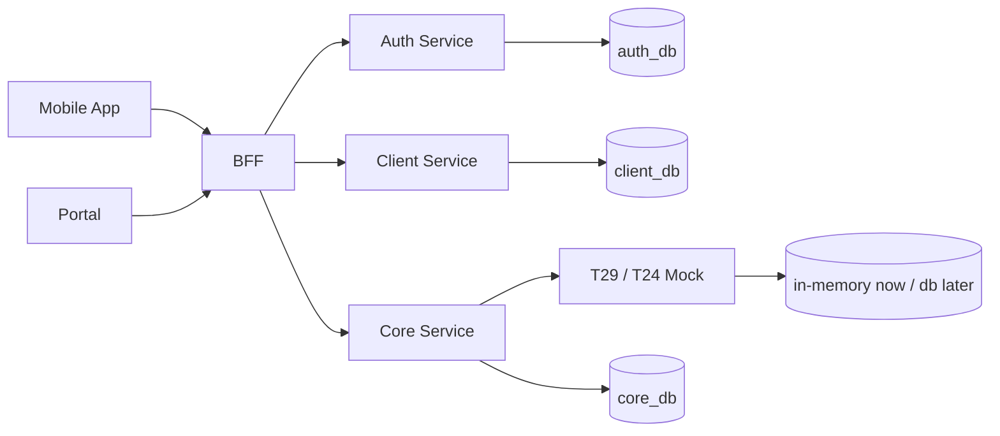

# TruongSonBank Architecture / Flow / DB Brainstorm

Status: draft, not approved.

## 1. Current Context

The repo currently has these Spring Boot modules:

- `auth`: user authentication/identity.
- `bff`: API gateway/BFF for mobile/web.
- `client`: manages bank customers/users.
- `core`: main business capabilities such as transfer and payment.
- `t29`: mock core banking/T24, currently storing accounts by CCCD and balances in RAM.
- `common`, `sharedpackage`: shared modules, currently without a clear contract.
- `mobileapp`, `portal`: currently empty.

The code is currently close to a skeleton. Therefore the architecture should be finalized from use cases and boundaries first, and should not add frameworks/dependencies beyond real needs yet.

## 2. Priority Blocks

### P0 - Core Money Flow

Goal: run the open-account, balance inquiry, and transfer/payment flows.

Blocks:

- `t29`: temporary source of truth for accounts and balances.
- `core`: receives transfer/payment commands, validates business rules, calls `t29`.
- `bff`: exposes APIs for client/mobile.

Reason to do this first: this is the backbone of the project. No matter how polished auth/portal/reporting are, if money does not move, the system does not have its core yet.

### P1 - Identity/Auth

Goal: login, identify the user, and map the user to CCCD/customer.

Blocks:

- `auth`: login, token, role.
- `client`: customer profile, CCCD, simple KYC status.
- `bff`: checks the token before calling core.

Reason to do this after P0: let P0 run quickly with a mock header/user id first, then attach real auth once the money flow is stable.

### P2 - Persistence + Audit

Goal: data survives restarts and transaction history exists.

Blocks:

- DB for `core`: transaction/payment/order state.
- DB for `client`: customer profile.
- DB for `auth`: user/credential/session if no external provider is used.
- DB or in-memory for `t29` depending on the simulation level.

Reason: needed before UAT, not mandatory for a RAM-only demo.

### P3 - Operations

Goal: easy to run and debug.

Blocks:

- Docker compose/local env.
- Logging/correlation id.
- Health checks.
- Seed data.

## 3. Architecture Options

### Option A - Modular Microservices, Minimal

Each Spring Boot module runs separately:

- `bff` calls `auth`, `client`, `core`.
- `core` calls `t29`.
- Each service has its own DB when needed.

Pros:

- Matches the current repo structure.
- Clear boundaries, easy to demo banking architecture.
- Can replace the `t29` mock with real core banking.

Cons:

- More processes.
- Need to manage config/ports/API contracts.

Recommendation: choose this direction, but implement it minimally.

### Option B - Single Backend First

Merge business logic into one backend app; `t29` is only an internal class/mock.

Pros:

- Fewer services, faster to code.
- Fewer network/config errors.

Cons:

- Deviates from the current repo structure.
- Splitting services later will be costly.

Use when: the goal is only a quick demo and does not need to show system architecture.

### Option C - Event-Driven

Transfer/payment publishes events, workers process asynchronously, with outbox/message broker.

Pros:

- Closer to production for payment.
- Easier audit/retry.

Cons:

- Too heavy for the current stage.
- Requires broker, outbox, idempotency and complex states.

Use when: real async processing, high volume, or integration with many external systems is needed.

## 4. Recommended High-Level Architecture

Principles:

- `t29` owns account balance.
- `core` owns business transaction state.
- `client` owns customer profile and CCCD.
- `auth` owns login/session/role.
- `bff` owns API shape for frontend, not money logic.

## 5. Draft Use Cases

### UC1 - Open Account

Actor: customer/mobile or operator/portal.

Flow:

1. BFF receives open account request.
2. BFF validates token with Auth.
3. BFF gets/creates customer profile in Client by CCCD.
4. BFF calls Core open account.
5. Core calls T29 open account with CCCD.
6. T29 returns account number.
7. Core stores account link/state if persistence is enabled.
8. BFF returns account number.

### UC2 - View Balance

Flow:

1. BFF receives account balance request.
2. BFF validates token and account ownership.
3. BFF/Core calls T29 balance.
4. T29 returns balance.

### UC3 - Internal Transfer

Flow:

1. BFF receives fromAccount, toAccount, amount, requestId.
2. BFF validates token.
3. Core validates amount, account ownership, idempotency.
4. Core creates transaction `PENDING`.
5. Core calls T29 transfer.
6. T29 debits source and credits destination.
7. Core marks transaction `SUCCESS` or `FAILED`.
8. BFF returns final status.

### UC4 - Payment

Flow:

1. BFF receives source account, merchant/bill target, amount, requestId.
2. Core creates payment `PENDING`.
3. Core maps payment target to destination account or mock merchant account.
4. Core calls T29 transfer/debit.
5. Core marks payment `SUCCESS` or `FAILED`.

## 6. Draft DB Design Direction

### `auth_db`

Minimum tables:

- `users`: id, username/phone, password hash or external id, status.
- `roles`: id, code.
- `user_roles`: user_id, role_id.

Skip for now if auth is mocked.

### `client_db`

Minimum tables:

- `customers`: id, cccd, full_name, phone, status, created_at.
- `customer_accounts`: customer_id, account_number, status, created_at.

### `core_db`

Minimum tables:

- `money_transactions`: id, request_id, type, from_account, to_account, amount, status, failure_reason, created_at, updated_at.
- `payments`: id, request_id, source_account, target_type, target_ref, amount, status, transaction_id, created_at, updated_at.

Important constraints:

- Unique `request_id` per operation type for idempotency.
- Amount must be positive.
- Status enum: `PENDING`, `SUCCESS`, `FAILED`.

### `t29_db` Later, Optional

Current RAM model:

- account_number
- cccd
- balance

If persisted later:

- `accounts`: account_number, cccd, balance, status, created_at.

## 7. Open Decisions

Need to clear before final architecture:

1. Project goal: demo only, UAT, or production-like?
2. Frontend target: mobile app, portal, both, or backend only?
3. Auth: simple username/password JWT, OTP, or external provider?
4. DB: PostgreSQL, MySQL, H2, or no DB for first milestone?
5. T29 mock persistence: RAM only or DB-backed?
6. Payment target: internal account only, merchant account, bill provider, or generic mock?
7. Transfer scope: internal only or interbank simulation?
8. Deployment: local only, Docker Compose, Kubernetes, or cloud?

## 8. Proposed Decision Order

1. Confirm target milestone and scope.
2. Confirm tech stack and DB.
3. Finalize service boundaries.
4. Finalize use case flows.
5. Finalize DB schema.
6. Break implementation into small tasks.
