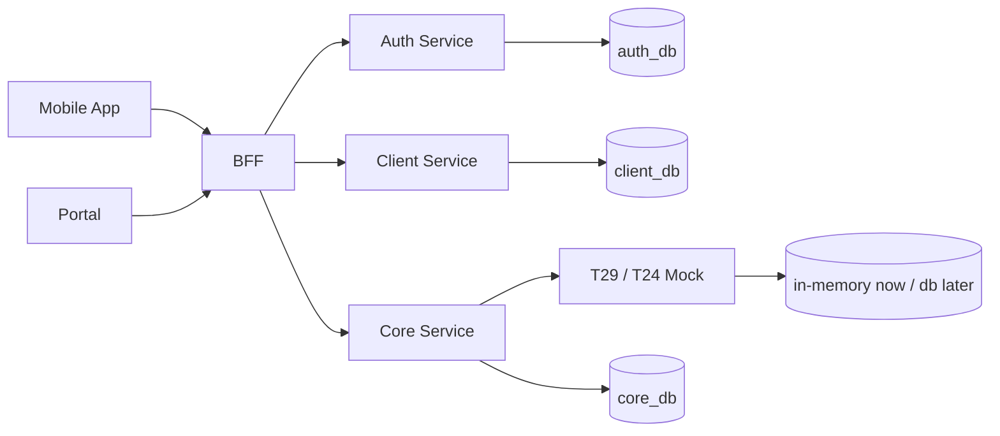

# TruongSonBank Architecture / Flow / DB Brainstorm

Status: draft, not approved.

## 1. Current Context

Repo hiện có các Spring Boot module:

- `auth`: xác thực/định danh người dùng.
- `bff`: API gateway/BFF cho mobile/web.
- `client`: quản lý khách hàng/người dùng ngân hàng.
- `core`: nghiệp vụ chính như transfer, payment.
- `t29`: mock core banking/T24, hiện lưu account theo CCCD và balance trong RAM.
- `common`, `sharedpackage`: dùng chung, hiện chưa có contract rõ.
- `mobileapp`, `portal`: đang trống.

Hiện code gần như skeleton. Vì vậy kiến trúc nên chốt từ use case và boundary trước, chưa nên thêm framework/dependency ngoài nhu cầu thật.

## 2. Priority Blocks

### P0 - Core Money Flow

Mục tiêu: chạy được luồng mở tài khoản, xem số dư, transfer/payment.

Khối:

- `t29`: source of truth tạm thời cho account và balance.
- `core`: nhận lệnh chuyển tiền/thanh toán, validate nghiệp vụ, gọi `t29`.
- `bff`: expose API cho client/mobile.

Lý do làm trước: đây là trục sống của dự án. Auth/portal/report đẹp đến đâu mà tiền không chạy thì hệ thống chưa có lõi.

### P1 - Identity/Auth

Mục tiêu: đăng nhập, định danh user, map user với CCCD/customer.

Khối:

- `auth`: login, token, role.
- `client`: hồ sơ khách hàng, CCCD, trạng thái KYC đơn giản.
- `bff`: kiểm tra token trước khi gọi core.

Lý do làm sau P0: để P0 chạy nhanh bằng mock header/user id trước, rồi gắn auth thật khi flow tiền ổn.

### P2 - Persistence + Audit

Mục tiêu: dữ liệu không mất sau restart, có lịch sử giao dịch.

Khối:

- DB cho `core`: transaction/payment/order state.
- DB cho `client`: customer profile.
- DB cho `auth`: user/credential/session nếu không dùng provider ngoài.
- DB hoặc in-memory cho `t29` tùy mức giả lập.

Lý do: cần trước UAT, chưa bắt buộc cho demo RAM.

### P3 - Operations

Mục tiêu: dễ chạy, dễ debug.

Khối:

- Docker compose/local env.
- Logging/correlation id.
- Health checks.
- Seed data.

## 3. Architecture Options

### Option A - Modular Microservices, Minimal

Mỗi module Spring Boot chạy riêng:

- `bff` gọi `auth`, `client`, `core`.
- `core` gọi `t29`.
- Mỗi service có DB riêng khi cần.

Pros:

- Khớp structure repo hiện tại.
- Boundary rõ, dễ demo kiến trúc ngân hàng.
- Có thể thay `t29` mock bằng core banking thật.

Cons:

- Nhiều process hơn.
- Cần quản lý config/port/API contract.

Recommendation: chọn hướng này, nhưng triển khai tối giản.

### Option B - Single Backend First

Gộp nghiệp vụ vào một app backend, `t29` chỉ là class/mock nội bộ.

Pros:

- Ít service, nhanh code.
- Ít lỗi network/config.

Cons:

- Lệch structure repo hiện tại.
- Sau này tách service sẽ tốn công.

Use when: mục tiêu chỉ là demo nhanh, không cần thể hiện kiến trúc hệ thống.

### Option C - Event-Driven

Transfer/payment phát event, worker xử lý async, có outbox/message broker.

Pros:

- Gần production hơn cho payment.
- Dễ audit/retry.

Cons:

- Quá nặng cho giai đoạn hiện tại.
- Cần broker, outbox, idempotency, trạng thái phức tạp.

Use when: cần xử lý async thật, volume cao, hoặc tích hợp nhiều hệ thống ngoài.

## 4. Recommended High-Level Architecture

Principles:

- `t29` owns account balance.
- `core` owns business transaction state.
- `client` owns customer profile and CCCD.
- `auth` owns login/session/role.
- `bff` owns API shape for frontend, not money logic.

## 5. Draft Use Cases

### UC1 - Open Account

Actor: customer/mobile or operator/portal.

Flow:

1. BFF receives open account request.
2. BFF validates token with Auth.
3. BFF gets/creates customer profile in Client by CCCD.
4. BFF calls Core open account.
5. Core calls T29 open account with CCCD.
6. T29 returns account number.
7. Core stores account link/state if persistence is enabled.
8. BFF returns account number.

### UC2 - View Balance

Flow:

1. BFF receives account balance request.
2. BFF validates token and account ownership.
3. BFF/Core calls T29 balance.
4. T29 returns balance.

### UC3 - Internal Transfer

Flow:

1. BFF receives fromAccount, toAccount, amount, requestId.
2. BFF validates token.
3. Core validates amount, account ownership, idempotency.
4. Core creates transaction `PENDING`.
5. Core calls T29 transfer.
6. T29 debits source and credits destination.
7. Core marks transaction `SUCCESS` or `FAILED`.
8. BFF returns final status.

### UC4 - Payment

Flow:

1. BFF receives source account, merchant/bill target, amount, requestId.
2. Core creates payment `PENDING`.
3. Core maps payment target to destination account or mock merchant account.
4. Core calls T29 transfer/debit.
5. Core marks payment `SUCCESS` or `FAILED`.

## 6. Draft DB Design Direction

### `auth_db`

Minimum tables:

- `users`: id, username/phone, password hash or external id, status.
- `roles`: id, code.
- `user_roles`: user_id, role_id.

Skip for now if auth is mocked.

### `client_db`

Minimum tables:

- `customers`: id, cccd, full_name, phone, status, created_at.
- `customer_accounts`: customer_id, account_number, status, created_at.

### `core_db`

Minimum tables:

- `money_transactions`: id, request_id, type, from_account, to_account, amount, status, failure_reason, created_at, updated_at.
- `payments`: id, request_id, source_account, target_type, target_ref, amount, status, transaction_id, created_at, updated_at.

Important constraints:

- Unique `request_id` per operation type for idempotency.
- Amount must be positive.
- Status enum: `PENDING`, `SUCCESS`, `FAILED`.

### `t29_db` Later, Optional

Current RAM model:

- account_number
- cccd
- balance

If persisted later:

- `accounts`: account_number, cccd, balance, status, created_at.

## 7. Open Decisions

Need to clear before final architecture:

1. Project goal: demo only, UAT, or production-like?
2. Frontend target: mobile app, portal, both, or backend only?
3. Auth: simple username/password JWT, OTP, or external provider?
4. DB: PostgreSQL, MySQL, H2, or no DB for first milestone?
5. T29 mock persistence: RAM only or DB-backed?
6. Payment target: internal account only, merchant account, bill provider, or generic mock?
7. Transfer scope: internal only or interbank simulation?
8. Deployment: local only, Docker Compose, Kubernetes, or cloud?

## 8. Proposed Decision Order

1. Confirm target milestone and scope.
2. Confirm tech stack and DB.
3. Finalize service boundaries.
4. Finalize use case flows.
5. Finalize DB schema.
6. Break implementation into small tasks.

