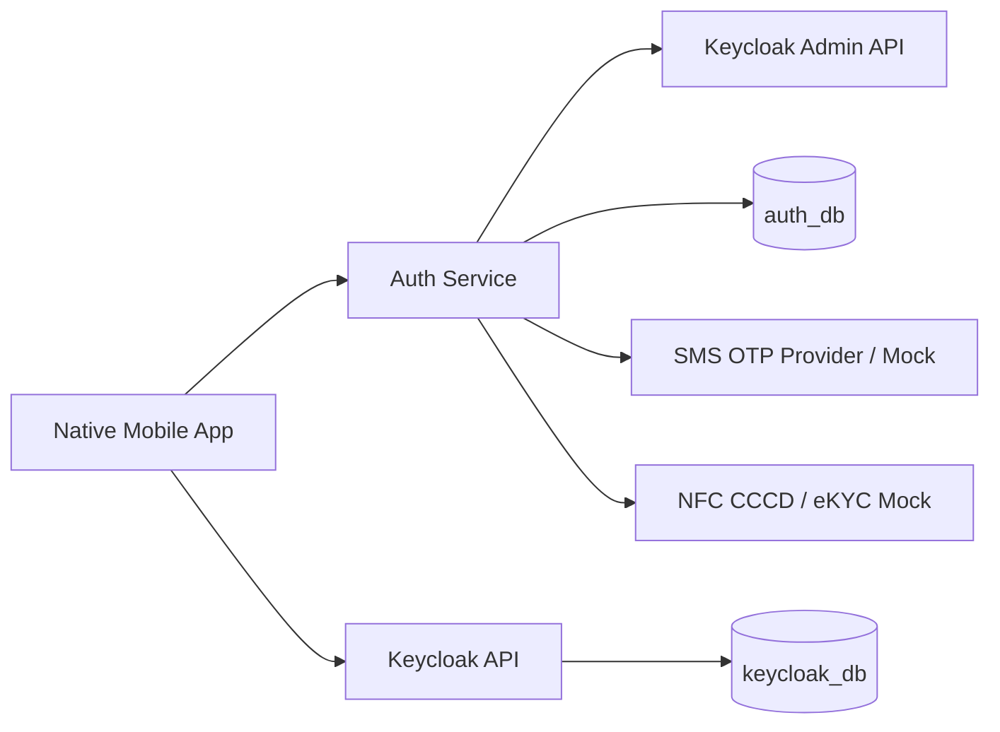
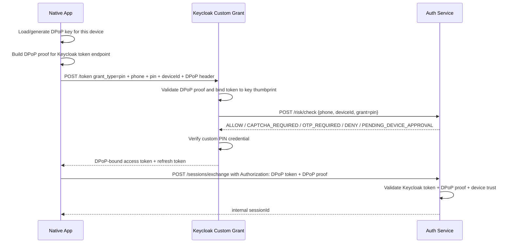
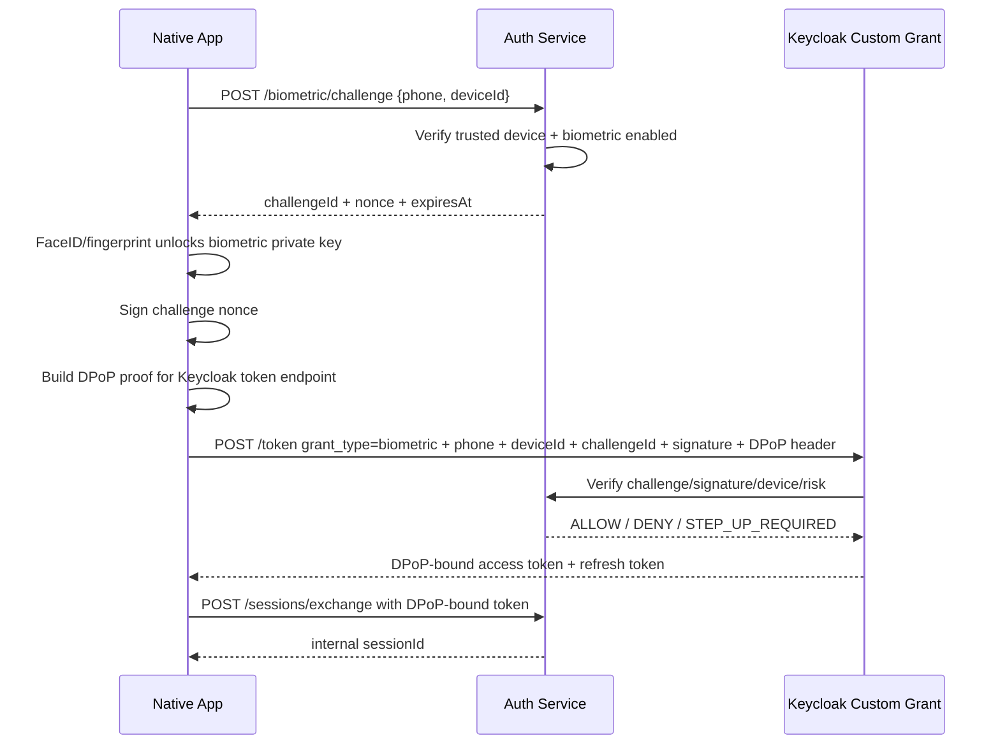
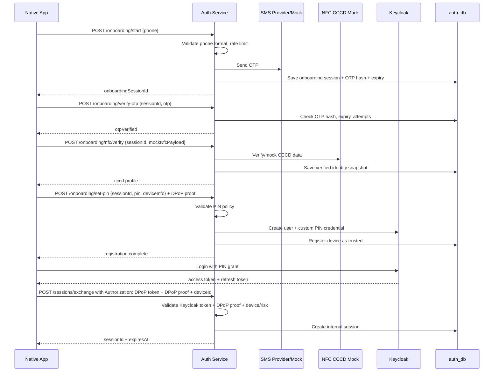
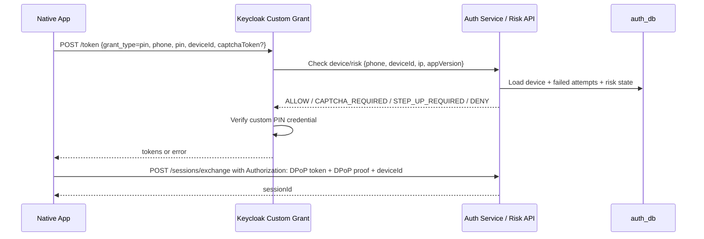
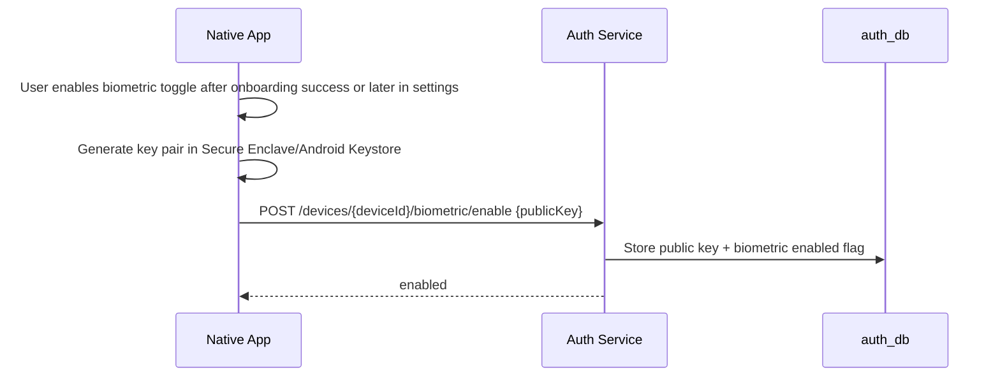
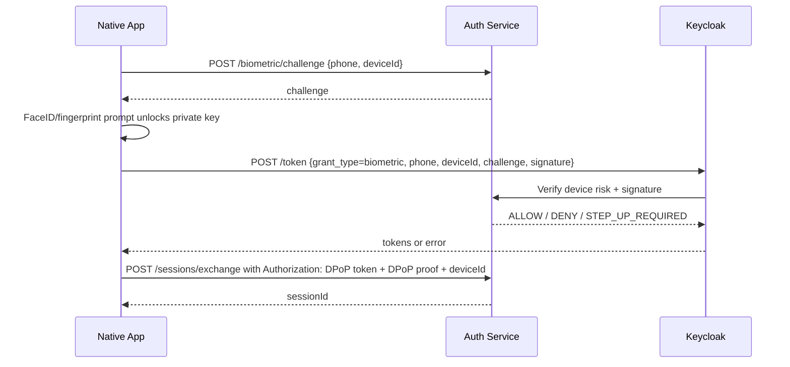
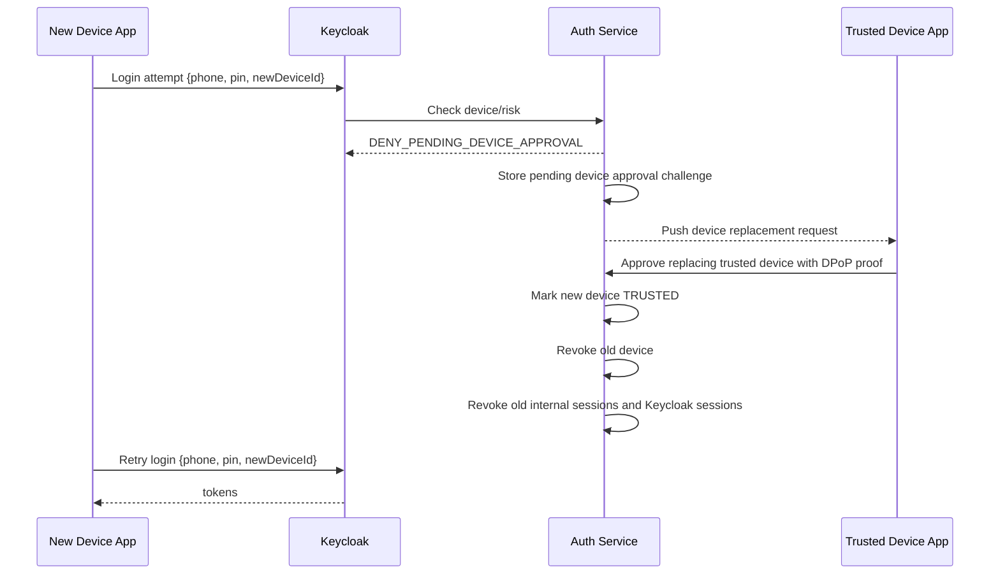

# Auth Block Brainstorm

Status: draft, not approved.

## 1. Scope

Auth phục vụ native app, không dùng web view/web UI.

Main flows:

- Onboarding bằng phone -> SMS OTP -> NFC CCCD mock -> setup PIN -> vào màn chính.
- Login bằng phone + PIN. Phone là username chính trong Keycloak.
- Login bằng FaceID/vân tay qua toggle trên app.
- Trusted device và device/risk/security checks.
- Keycloak là identity store/token issuer. App gọi API Keycloak để login.

Non-goals for first design:

- Không xử lý biometric raw data trên server.
- Không làm web login page.
- Không làm eKYC/NFC thật, chỉ mock step nhưng giữ contract.
- Không làm external fraud engine ngay.

## 2. Recommended Architecture



Responsibilities:

- Native app owns UI, device biometric prompt, local secure storage.
- Keycloak owns user, PIN credential/custom credential, access token, refresh token.
- Auth Service owns onboarding orchestration, OTP, device registry, risk decisions, internal app sessions, Keycloak admin calls.
- Auth DB owns OTP attempts, onboarding state, device trust state, audit/risk logs.

Recommended: keep login token issuance in Keycloak. Customize Keycloak only for PIN/biometric credential and grant handling; device/risk decisions stay in Auth Service and are called by the custom grant. Do not fork Keycloak.

## 3. Key Design Decision: PIN In Keycloak

### Option A - PIN as Keycloak Password

App calls standard Resource Owner Password Credentials grant:

- username = phone/username
- password = PIN

Pros:

- Fastest.
- No custom Keycloak code.

Cons:

- Bad security fit: PIN is short, password policy conflicts, brute force risk.
- Hard to bind PIN login to trusted device.
- Harder to separate app PIN from real password.

Use only for throwaway demo.

### Option B - Custom Keycloak PIN Credential + Direct Grant Authenticator

Keycloak stores PIN as a custom credential type. Login uses custom grant/direct-grant flow:

- phone as username
- PIN
- device id
- risk/captcha token when required

Pros:

- Correct boundary: PIN is not a normal password.
- Can enforce device trust, lockout, captcha, step-up.
- Fits native app API login.

Cons:

- Requires Keycloak SPI/customization.

Recommendation: Option B.

Final decision: use Option B, with the narrowest Keycloak customization:

- Custom PIN credential.
- Custom biometric grant/credential verification.
- Custom grant calls Auth Service for device/risk decision.
- Auth Service stores onboarding, trusted device, risk, and internal session state.

### Option C - Auth Service Verifies PIN, Keycloak Token Exchange

Auth Service checks PIN/device then exchanges/requests token from Keycloak.

Pros:

- Less Keycloak custom login logic.
- Risk logic stays in Java service.

Cons:

- Auth Service becomes highly sensitive.
- More custom token plumbing.

Use if Keycloak customization is blocked.

## 3.1. Keycloak Standards And Token Flow

### Standards Used

- OpenID Connect for identity tokens and user identity.
- OAuth 2.0 token endpoint for native app token issuance.
- DPoP (RFC 9449) for sender-constrained access/refresh tokens.
- HTTPS everywhere. DPoP is not a replacement for TLS.
- Native app is a public client; it must not rely on a client secret.

### Keycloak Client Configuration

Realm/client setup:

- Client type: public native mobile client.
- Standard flow: optional for future; not required for PIN/biometric custom grant.
- Direct/custom grant: enabled for `pin` and `biometric`.
- Require DPoP bound tokens: enabled.
- Refresh token rotation/reuse detection: enabled where supported.
- Access token lifetime: short, because app will exchange token for internal session.
- User identifier: phone stored as Keycloak username.

Custom Keycloak providers:

- Custom PIN credential provider.
- Custom `grant_type=pin`.
- Custom `grant_type=biometric`.
- Both grants call Auth Service risk/device API before token issuance.

### DPoP Key Model

The native app generates an asymmetric DPoP key pair per trusted device.

- Private key stays in Secure Enclave/Android Keystore when possible.
- Public key is sent to Keycloak inside each DPoP proof JWT.
- Keycloak binds issued tokens to the public key thumbprint in the token `cnf.jkt` claim.
- Refresh token requests must also include a valid DPoP proof signed by the same key.
- If the trusted device is revoked/replaced, Auth Service revokes internal sessions and Keycloak sessions for that device.

DPoP proof header:

- `typ = dpop+jwt`
- `alg = ES256` preferred
- `jwk = public key`

DPoP proof body:

- `jti`: unique proof id
- `htm`: HTTP method
- `htu`: target URL without query/fragment
- `iat`: creation time
- `ath`: access token hash when calling resource APIs with an access token
- `nonce`: only when server challenged with `DPoP-Nonce`

### Login With PIN, DPoP Bound



### Login With Biometric, Challenge Bound

Biometric login uses two proofs:

- Local biometric unlock proves the user can unlock the device-held private key.
- Server challenge prevents replay of old biometric signatures.



### Challenge Types

`DPoP-Nonce`

- Issued by Keycloak/Auth/BFF when proof freshness is required.
- Client retries the same request with a new DPoP proof containing `nonce`.

`biometricChallenge`

- Issued by Auth Service.
- Short-lived and single-use.
- Signed by the device biometric/private key.

`deviceApprovalChallenge`

- Created when a new device attempts login.
- Delivered to the existing trusted device.
- Approving it replaces the trusted device.

`stepUpChallenge`

- Issued when risk is elevated.
- Can require mock captcha, OTP, or recovery path depending on risk.

### API Calls After Internal Session Is Issued

Default for TruongSonBank APIs:

- App calls BFF/Core/Client with internal `sessionId`.
- BFF validates session with Auth Service.
- Business services do not need to parse Keycloak tokens in the first milestone.

High-security alternative later:

- Require both internal `sessionId` and DPoP proof on sensitive API calls.
- Bind the internal session to the same DPoP key thumbprint used for Keycloak login.

First milestone decision: bind internal `sessionId` to `deviceId` and Keycloak user; keep DPoP verification on `/sessions/exchange`, Keycloak refresh/logout, and any future high-risk endpoint.

### Keycloak Implementation Checklist

1. Create realm for TruongSonBank.
2. Create public mobile client.
3. Enable required DPoP-bound tokens on the mobile client.
4. Configure token lifetimes and refresh token rotation/reuse detection.
5. Implement PIN credential provider.
6. Implement `grant_type=pin` provider.
7. Implement biometric grant provider.
8. Grant providers call Auth Service `/risk/check`.
9. Auth Service `/sessions/exchange` validates:
   - Keycloak issuer/audience/signature.
   - token `cnf.jkt` exists.
   - request uses `Authorization: DPoP <token>`.
   - `DPoP` header proof is valid for method and URL.
   - proof key thumbprint matches token `cnf.jkt`.
   - device is trusted and belongs to the same Keycloak user.
10. BFF validates internal `sessionId` with Auth Service for normal business APIs.

## 4. Onboarding Flow



Rules:

- Phone must be unique per active user.
- One CCCD can have only one active phone/user at a time.
- Phone change is allowed through a separate recovery/change-phone flow.
- OTP is 6 digits, expires after 3 minutes, and allows at most 3 failed attempts.
- OTP sending is rate-limited to 3 OTP messages per 10 minutes per phone number.
- NFC step returns server-generated valid mock CCCD data based on onboarding session/phone.
- PIN is exactly 6 digits.
- Weak PINs are rejected, including repeated digits, simple sequences like `123456`, and values derived from user identity data such as date of birth when available.
- PIN never stored in Auth DB.
- Device registered at successful onboarding; Auth Service computes `dpop_jkt` from the DPoP proof and binds it to the first trusted device.
- After onboarding completes, app calls Keycloak token API with phone + PIN; Auth Service does not mint tokens.
- After receiving Keycloak token, app exchanges it with Auth Service for an internal `sessionId`.
- App uses internal `sessionId` for TruongSonBank APIs; Keycloak token is not exposed to downstream business services unless explicitly needed.

## 5. Login With PIN Flow

This is the username/password style login for the native app, where:

- username = `phone`
- password credential = 6-digit `PIN` stored as a custom Keycloak credential



Detailed steps:

1. App prepares:
   - `phone`
   - `pin`
   - `deviceId`
   - `captchaToken`, only when previous response requires captcha
   - DPoP private key from Secure Enclave/Android Keystore
2. App builds a DPoP proof for Keycloak token endpoint:
   - `htm = POST`
   - `htu = https://keycloak.../realms/{realm}/protocol/openid-connect/token`
   - `jti = random uuid`
   - `iat = now`
   - `nonce = DPoP-Nonce`, only if challenged
3. App calls Keycloak:

```http
POST /realms/{realm}/protocol/openid-connect/token
DPoP: <signed_dpop_proof_jwt>
Content-Type: application/x-www-form-urlencoded

grant_type=pin
client_id=truongsonbank-mobile
username=<phone>
pin=<pin>
device_id=<deviceId>
captcha_token=<optional>
```

4. Keycloak custom PIN grant:
   - validates DPoP proof
   - computes thumbprint from proof public key
   - calls Auth Service `/risk/check`
   - verifies custom PIN credential
   - issues DPoP-bound tokens
5. Keycloak returns:

```json
{
  "access_token": "<jwt-with-cnf.jkt>",
  "refresh_token": "<dpop-bound-refresh-token>",
  "token_type": "DPoP",
  "expires_in": 300
}
```

6. App builds a new DPoP proof for Auth Service `/sessions/exchange`.
7. App exchanges the Keycloak token for an internal session:

```http
POST /sessions/exchange
Authorization: DPoP <keycloak_access_token>
DPoP: <signed_dpop_proof_jwt_for_sessions_exchange>
Content-Type: application/json

{
  "deviceId": "<deviceId>"
}
```

8. Auth Service validates:
   - Keycloak issuer/audience/signature
   - Keycloak token `cnf.jkt`
   - DPoP proof signature
   - thumbprint from proof public key equals token `cnf.jkt`
   - thumbprint equals `trusted_devices.dpop_jkt`
   - device belongs to this Keycloak user and is `TRUSTED`
9. Auth Service creates internal session:
   - stores hashed `sessionId`
   - stores `keycloak_user_id`
   - stores `device_id`
   - stores `dpop_jkt`
   - stores idle and absolute expiry
10. Auth Service returns:

```json
{
  "sessionId": "<opaque-random-session-id>",
  "idleExpiresIn": 600,
  "absoluteExpiresAt": "2026-09-21T16:00:00Z"
}
```

After login:

- Normal APIs use `X-Session-Id`.
- Sensitive APIs use `X-Session-Id` plus a DPoP proof signed by the same device key.
- Refresh token requests to Keycloak must also include a DPoP proof.

Risk/security checks:

- Unknown device: deny token issuance and create a pending device approval request.
- Untrusted device: deny token issuance unless approved by an existing trusted device.
- Trusted device with normal risk: PIN is enough, no OTP.
- Trusted device with elevated risk: require OTP and/or captcha step-up.
- PIN failure lockout is progressive: 5 failed attempts lock for 15 minutes; repeated lockouts require recovery/reset PIN.
- Suspicious IP/location/app version: captcha or OTP step-up.
- Rooted/jailbroken/emulator signal: deny or step-up, depending policy.
- Refresh token reuse: revoke session family.

## 6. Login With FaceID / Fingerprint Flow

Biometric is local only. Server trusts a device-bound credential, not the face/fingerprint itself.

Enrollment:



Enrollment detailed steps:

1. User enables biometric after onboarding success or later in settings.
2. App asks OS to create biometric-protected key pair.
3. OS stores private key in Secure Enclave/Android Keystore.
4. App sends public key to Auth Service:

```http
POST /devices/{deviceId}/biometric/enable
X-Session-Id: <sessionId>
Content-Type: application/json

{
  "publicKey": "<biometric-public-jwk>"
}
```

5. Auth Service stores the biometric public key on the trusted device record.

Login:



Detailed steps:

1. App requests a challenge:

```http
POST /biometric/challenge
Content-Type: application/json

{
  "phone": "<phone>",
  "deviceId": "<deviceId>"
}
```

2. Auth Service validates:
   - device is `TRUSTED`
   - biometric is enabled
   - biometric public key exists
   - device trust has not expired
3. Auth Service stores a single-use challenge and returns:

```json
{
  "challengeId": "<challenge-id>",
  "nonce": "<random-nonce>",
  "expiresIn": 60
}
```

4. App prompts FaceID/fingerprint.
5. If biometric succeeds, OS unlocks biometric private key.
6. App signs challenge payload:

```json
{
  "challengeId": "<challenge-id>",
  "nonce": "<random-nonce>",
  "phone": "<phone>",
  "deviceId": "<deviceId>"
}
```

7. App builds DPoP proof for Keycloak token endpoint.
8. App calls Keycloak:

```http
POST /realms/{realm}/protocol/openid-connect/token
DPoP: <signed_dpop_proof_jwt>
Content-Type: application/x-www-form-urlencoded

grant_type=biometric
client_id=truongsonbank-mobile
username=<phone>
device_id=<deviceId>
challenge_id=<challengeId>
signature=<biometric_challenge_signature>
```

9. Keycloak biometric custom grant calls Auth Service to verify:
   - challenge exists and is not expired
   - challenge was not used before
   - signature matches stored biometric public key
   - device is still trusted
   - risk decision allows login
10. Keycloak returns DPoP-bound tokens:

```json
{
  "access_token": "<jwt-with-cnf.jkt>",
  "refresh_token": "<dpop-bound-refresh-token>",
  "token_type": "DPoP",
  "expires_in": 300
}
```

11. App exchanges token for internal session with `/sessions/exchange`, same as PIN login.
12. Auth Service returns internal `sessionId`.

Rules:

- Toggle can be enabled immediately after successful onboarding on the first trusted device, or later from settings.
- Disable biometric deletes server public key and local private key.
- If device is untrusted/revoked, biometric login fails.
- If OS biometric set changes, native app should invalidate local key and require PIN again.
- PIN reset/recovery disables biometric; user must enable biometric again after successful reset.

## 7. Trusted Device Model

Device states:

- `NEW`: seen but not verified.
- `TRUSTED`: can use PIN login normally and biometric if enabled.
- `UNTRUSTED`: known but not trusted; requires OTP step-up.
- `REVOKED`: cannot login.

Device fields:

- `device_id`: app-generated stable id.
- `user_id`
- `dpop_jkt`
- `platform`: IOS/ANDROID
- `device_name`
- `app_version`
- `os_version`
- `push_token_hash`
- `biometric_enabled`
- `public_key`
- `status`
- `first_seen_at`
- `last_seen_at`
- `trusted_at`
- `revoked_at`

Policy:

- First device after onboarding becomes trusted.
- Each user can have only one trusted device.
- New device login cannot complete by OTP alone.
- New device login creates a pending device replacement approval request.
- Existing trusted device must approve replacing itself with the new device before the new device can login.
- Approving a new device revokes the old trusted device.
- User can manage/revoke devices in app.
- Device trust expires after 90 days of inactivity.

New device approval:



Detailed replacement flow:

1. New device creates its own DPoP key pair and `deviceId`.
2. New device attempts PIN login with Keycloak.
3. Keycloak calls Auth `/risk/check`.
4. Auth sees this is not the trusted device and creates a `device_approval_requests` row:
   - old trusted device id
   - pending new device id
   - pending new device `dpop_jkt`
   - challenge id
   - expiry
5. Auth returns `PENDING_DEVICE_APPROVAL`.
6. Old trusted device receives push/in-app approval request.
7. Old trusted device calls `POST /devices/{newDeviceId}/trust` with:
   - current internal `sessionId`
   - DPoP proof signed by old trusted device key
   - approval challenge id
8. Auth validates current session + old trusted DPoP proof.
9. Auth marks new device `TRUSTED`, revokes old trusted device, revokes old sessions.
10. New device retries Keycloak login and can now exchange token for a new internal session.

Trusted device recovery:

- If user still has the trusted device, new device must be approved from that trusted device and replaces it.
- If user lost all trusted devices, recovery path is OTP SMS + NFC CCCD mock + PIN reset.
- Admin portal/manual verification is the fallback when self-service recovery fails.
- Successful recovery revokes old trusted devices unless user explicitly keeps them through admin support.

## 7.1. Session Model

Session is owned by Auth Service, not Keycloak.

Creation:

- App first gets DPoP-bound token from Keycloak.
- App calls `/sessions/exchange`.
- Auth validates Keycloak token, DPoP proof, and trusted device.
- Auth generates opaque `sessionId`.
- Auth stores only `session_id_hash`, never raw `sessionId`.
- Auth stores `dpop_jkt` copied from the verified DPoP proof/token binding.

Usage:

- Normal APIs send `X-Session-Id`.
- Sensitive APIs send `X-Session-Id` plus DPoP proof.
- BFF asks Auth to validate session or uses a signed/cache-backed validation result.

Expiry:

- Idle timeout: 10 minutes.
- Keep-alive extends idle timeout while session is active.
- Absolute timeout: 8 hours.
- Device revoke, logout, recovery, or device replacement revokes related sessions immediately.

Visibility:

- `GET /sessions` returns active/recent sessions for the current user.
- `GET /devices` returns trusted/revoked/pending device state.
- Because only one trusted device is allowed, normally there is one active device but there can be multiple short-lived sessions over time for that device.

## 8. APIs Draft

Auth Service:

- `POST /onboarding/start`
- `POST /onboarding/verify-otp`
- `POST /onboarding/nfc/verify`
- `POST /onboarding/set-pin`
- `GET /devices`
- `POST /devices/{deviceId}/trust`
- `POST /devices/{deviceId}/revoke`
- `POST /devices/{deviceId}/biometric/enable`
- `POST /devices/{deviceId}/biometric/disable`
- `POST /biometric/challenge`
- `POST /risk/check`
- `POST /sessions/exchange`
- `POST /sessions/logout`
- `POST /sessions/keep-alive`
- `GET /sessions/current`
- `GET /sessions`
- `POST /sessions/{sessionId}/revoke`

Keycloak custom/token APIs:

- `POST /realms/{realm}/protocol/openid-connect/token` with `grant_type=pin`, using phone as username.
- `POST /realms/{realm}/protocol/openid-connect/token` with `grant_type=biometric`, using phone as username.
- `POST /realms/{realm}/protocol/openid-connect/logout`

## 8.1. API Request / Response Samples

Common error shape:

```json
{
  "code": "VALIDATION_ERROR",
  "message": "phone is invalid",
  "traceId": "req_01J..."
}
```

### `POST /onboarding/start`

Request:

```json
{
  "phone": "84901234567"
}
```

Response:

```json
{
  "onboardingSessionId": "obs_01JABCDEF",
  "status": "STARTED",
  "otpExpiresIn": 180,
  "resendAvailableIn": 60
}
```

### `POST /onboarding/verify-otp`

Request:

```json
{
  "onboardingSessionId": "obs_01JABCDEF",
  "otp": "123456"
}
```

Response:

```json
{
  "onboardingSessionId": "obs_01JABCDEF",
  "status": "OTP_VERIFIED"
}
```

### `POST /onboarding/nfc/verify`

Request:

```json
{
  "onboardingSessionId": "obs_01JABCDEF"
}
```

Response:

```json
{
  "onboardingSessionId": "obs_01JABCDEF",
  "status": "NFC_VERIFIED",
  "identity": {
    "cccd": "079200012345",
    "fullName": "Nguyen Van A",
    "dateOfBirth": "2000-01-01",
    "issueDate": "2024-01-01",
    "issuePlace": "Cuc Canh Sat QLHC ve TTXH"
  }
}
```

### `POST /onboarding/set-pin`

Request:

```http
POST /onboarding/set-pin
DPoP: <signed_dpop_proof_jwt>
Content-Type: application/json

{
  "onboardingSessionId": "obs_01JABCDEF",
  "pin": "739204",
  "device": {
    "deviceId": "dev_iphone_15_abc",
    "platform": "IOS",
    "deviceName": "iPhone 15",
    "osVersion": "18.0",
    "appVersion": "1.0.0",
    "pushToken": "apns-token-value"
  }
}
```

Response:

```json
{
  "status": "COMPLETED",
  "phone": "84901234567",
  "keycloakUserId": "kc_user_123",
  "trustedDevice": {
    "deviceId": "dev_iphone_15_abc",
    "status": "TRUSTED",
    "dpopJkt": "sha256-jwk-thumbprint",
    "trustedAt": "2026-09-21T08:00:00Z"
  },
  "nextAction": "LOGIN_WITH_KEYCLOAK"
}
```

### Keycloak `POST /token` With `grant_type=pin`

Request:

```http
POST /realms/truongsonbank/protocol/openid-connect/token
DPoP: <signed_dpop_proof_jwt>
Content-Type: application/x-www-form-urlencoded

grant_type=pin
client_id=truongsonbank-mobile
username=84901234567
pin=739204
device_id=dev_iphone_15_abc
captcha_token=mock-captcha-token
```

Response:

```json
{
  "access_token": "<jwt-with-cnf.jkt>",
  "refresh_token": "<dpop-bound-refresh-token>",
  "token_type": "DPoP",
  "expires_in": 300,
  "refresh_expires_in": 1800
}
```

Risk response example:

```json
{
  "error": "step_up_required",
  "error_description": "CAPTCHA_REQUIRED",
  "challengeId": "stp_01JABCDEF"
}
```

### `POST /sessions/exchange`

Request:

```http
POST /sessions/exchange
Authorization: DPoP <keycloak_access_token>
DPoP: <signed_dpop_proof_jwt_for_sessions_exchange>
Content-Type: application/json

{
  "deviceId": "dev_iphone_15_abc"
}
```

Response:

```json
{
  "sessionId": "ses_opaque_random_value",
  "idleExpiresIn": 600,
  "absoluteExpiresAt": "2026-09-21T16:00:00Z",
  "deviceId": "dev_iphone_15_abc"
}
```

### `GET /sessions/current`

Request:

```http
GET /sessions/current
X-Session-Id: <sessionId>
```

Response:

```json
{
  "active": true,
  "phone": "84901234567",
  "keycloakUserId": "kc_user_123",
  "deviceId": "dev_iphone_15_abc",
  "idleExpiresAt": "2026-09-21T08:10:00Z",
  "absoluteExpiresAt": "2026-09-21T16:00:00Z"
}
```

### `GET /sessions`

Shows login sessions for the current user. Useful for "logged-in devices/sessions" screen.

Request:

```http
GET /sessions
X-Session-Id: <sessionId>
```

Response:

```json
{
  "sessions": [
    {
      "sessionId": "ses_current_masked",
      "current": true,
      "status": "ACTIVE",
      "deviceId": "dev_iphone_15_abc",
      "deviceName": "iPhone 15",
      "platform": "IOS",
      "appVersion": "1.0.0",
      "osVersion": "18.0",
      "ipAddress": "203.0.113.10",
      "createdAt": "2026-09-21T08:00:00Z",
      "lastSeenAt": "2026-09-21T08:05:00Z",
      "idleExpiresAt": "2026-09-21T08:15:00Z",
      "absoluteExpiresAt": "2026-09-21T16:00:00Z"
    }
  ]
}
```

### `POST /sessions/{sessionId}/revoke`

Revokes a visible session from the session management screen.

Request:

```http
POST /sessions/ses_current_masked/revoke
X-Session-Id: <currentSessionId>
DPoP: <signed_dpop_proof_for_sensitive_request>
```

Response:

```json
{
  "sessionId": "ses_current_masked",
  "status": "REVOKED"
}
```

### `POST /sessions/keep-alive`

Request:

```http
POST /sessions/keep-alive
X-Session-Id: <sessionId>
```

Response:

```json
{
  "sessionId": "ses_opaque_random_value",
  "idleExpiresIn": 600,
  "absoluteExpiresAt": "2026-09-21T16:00:00Z"
}
```

### `POST /sessions/logout`

Request:

```http
POST /sessions/logout
X-Session-Id: <sessionId>
Content-Type: application/json

{
  "refreshToken": "<keycloak_refresh_token>"
}
```

Response:

```json
{
  "status": "LOGGED_OUT"
}
```

### Keycloak `POST /logout`

Called by Auth Service or app when revoking the Keycloak session for the current device.

Request:

```http
POST /realms/truongsonbank/protocol/openid-connect/logout
DPoP: <signed_dpop_proof_jwt>
Content-Type: application/x-www-form-urlencoded

client_id=truongsonbank-mobile
refresh_token=<keycloak_refresh_token>
```

Response:

```http
204 No Content
```

### `GET /devices`

Request:

```http
GET /devices
X-Session-Id: <sessionId>
```

Response:

```json
{
  "devices": [
    {
      "deviceId": "dev_iphone_15_abc",
      "platform": "IOS",
      "deviceName": "iPhone 15",
      "status": "TRUSTED",
      "biometricEnabled": true,
      "trustedAt": "2026-09-21T08:00:00Z",
      "lastSeenAt": "2026-09-21T08:05:00Z"
    }
  ]
}
```

### `POST /devices/{deviceId}/revoke`

Request:

```http
POST /devices/dev_iphone_15_abc/revoke
X-Session-Id: <sessionId>
Content-Type: application/json

{
  "reason": "USER_REQUEST"
}
```

Response:

```json
{
  "deviceId": "dev_iphone_15_abc",
  "status": "REVOKED"
}
```

### `POST /devices/{deviceId}/trust`

Used by the current trusted device to approve replacing itself with a pending new device.

Request:

```http
POST /devices/dev_android_new/trust
X-Session-Id: <sessionId>
DPoP: <signed_dpop_proof_for_sensitive_request>
Content-Type: application/json

{
  "approvalChallengeId": "dap_01JABCDEF"
}
```

Response:

```json
{
  "trustedDevice": {
    "deviceId": "dev_android_new",
    "status": "TRUSTED"
  },
  "revokedDevice": {
    "deviceId": "dev_iphone_15_abc",
    "status": "REVOKED"
  }
}
```

### `POST /devices/{deviceId}/biometric/enable`

Request:

```http
POST /devices/dev_iphone_15_abc/biometric/enable
X-Session-Id: <sessionId>
Content-Type: application/json

{
  "publicKey": {
    "kty": "EC",
    "crv": "P-256",
    "x": "...",
    "y": "..."
  }
}
```

Response:

```json
{
  "deviceId": "dev_iphone_15_abc",
  "biometricEnabled": true
}
```

### `POST /devices/{deviceId}/biometric/disable`

Request:

```http
POST /devices/dev_iphone_15_abc/biometric/disable
X-Session-Id: <sessionId>
```

Response:

```json
{
  "deviceId": "dev_iphone_15_abc",
  "biometricEnabled": false
}
```

### `POST /biometric/challenge`

Request:

```json
{
  "phone": "84901234567",
  "deviceId": "dev_iphone_15_abc"
}
```

Response:

```json
{
  "challengeId": "bio_01JABCDEF",
  "nonce": "random-nonce",
  "expiresIn": 60
}
```

### Keycloak `POST /token` With `grant_type=biometric`

Request:

```http
POST /realms/truongsonbank/protocol/openid-connect/token
DPoP: <signed_dpop_proof_jwt>
Content-Type: application/x-www-form-urlencoded

grant_type=biometric
client_id=truongsonbank-mobile
username=84901234567
device_id=dev_iphone_15_abc
challenge_id=bio_01JABCDEF
signature=<signed_challenge_payload>
```

Response:

```json
{
  "access_token": "<jwt-with-cnf.jkt>",
  "refresh_token": "<dpop-bound-refresh-token>",
  "token_type": "DPoP",
  "expires_in": 300,
  "refresh_expires_in": 1800
}
```

### `POST /risk/check`

Internal API called by Keycloak custom grants.

Request:

```json
{
  "phone": "84901234567",
  "keycloakUserId": "kc_user_123",
  "deviceId": "dev_iphone_15_abc",
  "grantType": "pin",
  "ipAddress": "203.0.113.10",
  "appVersion": "1.0.0",
  "platform": "IOS",
  "captchaToken": "mock-captcha-token"
}
```

Response:

```json
{
  "decision": "ALLOW",
  "riskLevel": "LOW"
}
```

Step-up response:

```json
{
  "decision": "CAPTCHA_REQUIRED",
  "riskLevel": "MEDIUM",
  "challengeId": "stp_01JABCDEF"
}
```

Pending device response:

```json
{
  "decision": "PENDING_DEVICE_APPROVAL",
  "riskLevel": "HIGH",
  "approvalChallengeId": "dap_01JABCDEF"
}
```

## 9. DB Draft

### Auth Service DB

`onboarding_sessions`

- `id`
- `phone`
- `status`: `STARTED`, `OTP_VERIFIED`, `NFC_VERIFIED`, `PIN_SET`, `COMPLETED`, `EXPIRED`
- `otp_hash`
- `otp_expires_at`
- `otp_attempts`
- `cccd`
- `full_name`
- `date_of_birth`
- `created_at`
- `updated_at`

`trusted_devices`

- `id`
- `keycloak_user_id`
- `device_id`
- `dpop_jkt`
- `platform`
- `device_name`
- `app_version`
- `os_version`
- `status`
- `biometric_enabled`
- `biometric_public_key`
- `first_seen_at`
- `last_seen_at`
- `trusted_at`
- `revoked_at`

`device_approval_requests`

- `id`
- `challenge_id`
- `keycloak_user_id`
- `old_device_id`
- `new_device_id`
- `new_device_dpop_jkt`
- `status`: `PENDING`, `APPROVED`, `EXPIRED`, `DENIED`
- `expires_at`
- `created_at`
- `approved_at`

`auth_events`

- `id`
- `keycloak_user_id`
- `event_type`
- `device_id`
- `ip_address`
- `risk_level`
- `result`
- `reason`
- `created_at`

`app_sessions`

- `id`
- `session_id_hash`
- `session_display_id`
- `keycloak_user_id`
- `device_id`
- `dpop_jkt`
- `status`: `ACTIVE`, `EXPIRED`, `REVOKED`
- `ip_address`
- `user_agent`
- `app_version`
- `os_version`
- `created_at`
- `idle_expires_at`
- `absolute_expires_at`
- `last_seen_at`
- `revoked_at`

Session storage rule:

- DB stores long-lived audit/query state.
- Cache stores hot lookup state: `sessionId -> userId, deviceId, dpop_jkt, idleExpiresAt, absoluteExpiresAt, status`.
- Cache TTL follows `idle_expires_at`.
- Keep-alive updates cache and DB `last_seen_at`/`idle_expires_at`.
- Raw `sessionId` is never stored; only hash in DB/cache key.
- `session_display_id` is a short non-secret id for UI display/revoke actions.

`risk_counters`

- `id`
- `scope`: `PHONE`, `USER`, `DEVICE`, `IP`
- `scope_value`
- `counter_type`
- `count`
- `window_start`
- `locked_until`

### Keycloak DB

Managed by Keycloak:

- users
- credentials
- sessions
- refresh tokens
- custom PIN credential data

## 10. Required Security Rules

Minimum for UAT:

- OTP max attempts and expiry.
- PIN retry lockout.
- Device trust state.
- Refresh token rotation/reuse detection if supported/configured.
- Internal session id is opaque, random, stored hashed in Auth DB.
- Internal session has 10-minute idle timeout.
- `POST /sessions/keep-alive` extends the session when the session is active and device remains trusted.
- Internal session has 8-hour absolute timeout; after that, app must login through Keycloak again.
- If app stays in background for more than 2 minutes, foreground requires local unlock with PIN or biometric before using the active session.
- Logout revokes the internal session and the Keycloak refresh token/session for the current device.
- Captcha after suspicious pattern, not on every login.
- No biometric raw data leaves device.
- Audit every login/onboarding/device change.
- Rate limit phone/OTP/login endpoints.

Captcha implementation:

- First milestone uses mock captcha token verification.
- API contract keeps `captchaToken` so a real provider can replace the mock later.
- Captcha is risk-based, not required for every login.

Captcha trigger examples:

- Many OTP requests for same phone/IP.
- Many failed PIN attempts.
- Login from new device with suspicious IP.
- Automated traffic pattern.

## 11. Decisions So Far

1. Username is phone number.
2. PIN is 6 digits with weak-pattern rejection.
3. New device login requires approval from an existing trusted device.
4. Recovery when all trusted devices are lost uses OTP SMS + NFC CCCD mock + PIN reset; admin portal is fallback.
5. Captcha uses mock token verification first, with API contract ready for real provider later.
6. After PIN setup, app calls Keycloak token API; Auth Service does not auto-login.
7. Device trust expires after 90 days of inactivity.
8. Each user can have only one trusted device; approving a new one revokes the old one.
9. App exchanges Keycloak token with Auth Service to get an internal `sessionId`.
10. Internal session idle timeout is 10 minutes, keep-alive can extend it up to 8 hours.
11. App background longer than 2 minutes requires local PIN/biometric unlock on foreground.
12. Logout revokes internal session and Keycloak refresh token/session for current device.
