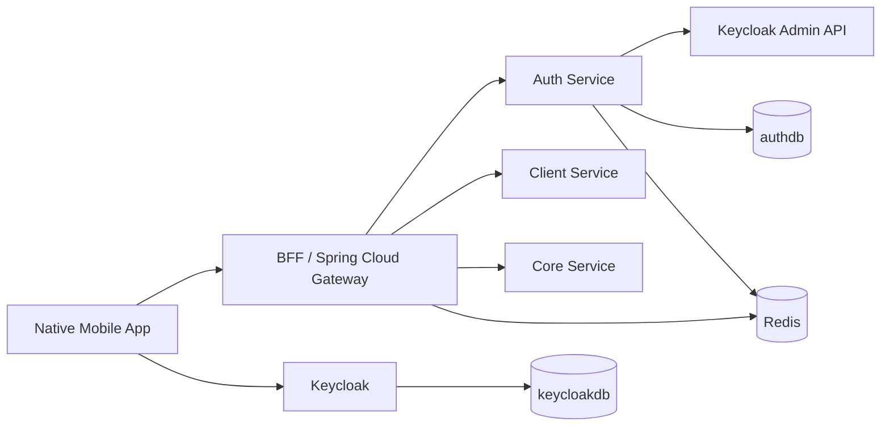

# Auth Like-Prod Implementation Plan

Status: draft for implementation.

Sources:

- `plan/auth-brainstorm.md`
- `plan/bff-layer-design.md`
- `plan/architecture-flow-db-brainstorm.md`
- `plan/base-framework-feature-checklist-vi.md`
- Current repo modules: `auth`, `bff`, `common`, `sharedpackage`

## 1. Target

Build Auth like production from the first runnable slice:

- Keycloak is real infrastructure, not mocked.
- Auth Service owns onboarding, device, internal session, audit, and role/scope mapping.
- BFF authenticates every protected route through Auth session validation and forwards trusted `X-Auth-*` headers.
- Downstream services authorize with sharedpackage annotations.
- Only external real-world providers are mocked first: SMS OTP, NFC CCCD, liveness, captcha, fraud engine.

## 2. Non-Negotiable Boundaries

- Native app UI only. No Keycloak web UI for mobile.
- Keycloak owns token issuance and identity credentials.
- Auth Service does not mint OAuth tokens.
- Internal `sessionId` is opaque and random.
- Raw `sessionId` is never stored in DB.
- BFF does not contain business logic or role decisions.
- Domain services must not trust client-supplied `X-Auth-*`.
- Phone, CCCD, tokens, OTP, PIN, session id must be masked in logs.

## 3. Final Runtime Shape



Local ports:

- BFF: `8086 -> 8080`, context `/bff/api`
- Auth: `8084`, context `/auth/api`
- Keycloak: `8088 -> 8080`
- Common: `8083`, context `/common/api`
- Redis: `6379`
- MySQL: `3306`

## 4. Implementation Phases

### P0 - Docker Infra

Goal: all required infra starts with compose.

Tasks:

1. Add MySQL schemas in `deployment/mysql/init`:
   - `authdb`
   - `keycloakdb`
2. Add Keycloak container:
   - image: stable Keycloak image
   - command: production-like start against MySQL
   - host port: `8088`
   - container port: `8080`
   - admin user/password for local only
   - health endpoint enabled
3. Add Keycloak realm import:
   - realm: `truongsonbank`
   - public mobile client: `truongsonbank-mobile`
   - internal confidential client: `truongsonbank-auth-admin`
   - demo user with username as phone
4. Add Auth container:
   - build from `auth`
   - port `8084`
   - DB `authdb`
   - Redis
   - OpenTelemetry collector
   - depends on MySQL, Redis, Keycloak
5. Add BFF gateway route:
   - `/bff/api/auth/**` -> `http://auth:8084/auth/api/**`

Done when:

- `curl http://localhost:8088/realms/truongsonbank/.well-known/openid-configuration` returns 200.
- `curl http://localhost:8084/auth/api/smoke` returns wrapped success.
- `curl http://localhost:8086/bff/api/auth/smoke` returns wrapped success.

### P1 - Auth Service Skeleton

Goal: Auth is a real Spring Boot service using the same platform defaults.

Tasks:

1. Import `sharedpackage`.
2. Configure:
   - response wrapper
   - exception handler
   - logging/masking
   - tracing
   - swagger
   - Redis
   - JPA datasource
3. Set service path:
   - `server.servlet.context-path=/auth/api`
4. Add packages:
   - `vn.com.truongsonbank.auth.session`
   - `vn.com.truongsonbank.auth.user`
   - `vn.com.truongsonbank.auth.device`
   - `vn.com.truongsonbank.auth.onboarding`
   - `vn.com.truongsonbank.auth.keycloak`
   - `vn.com.truongsonbank.auth.audit`
5. Add `GET /smoke`.

Done when:

- `mvn -f auth/pom.xml test` passes.
- Docker Auth starts and exposes Swagger.

### P2 - Auth DB Model

Goal: persist the minimum state needed for real session validation and onboarding.

Tables:

`auth_users`

- `id`
- `user_id`
- `customer_id`
- `keycloak_user_id`
- `phone_hash`
- `cccd_hash`
- `status`
- `created_at`
- `updated_at`

`trusted_devices`

- `id`
- `user_id`
- `keycloak_user_id`
- `device_id`
- `dpop_jkt`
- `platform`
- `device_name`
- `app_version`
- `os_version`
- `status`: `NEW`, `TRUSTED`, `UNTRUSTED`, `REVOKED`
- `biometric_enabled`
- `biometric_public_key`
- `first_seen_at`
- `last_seen_at`
- `trusted_at`
- `revoked_at`

`app_sessions`

- `id`
- `session_id_hash`
- `session_display_id`
- `user_id`
- `customer_id`
- `keycloak_user_id`
- `device_id`
- `dpop_jkt`
- `status`: `ACTIVE`, `EXPIRED`, `REVOKED`
- `ip_address`
- `user_agent`
- `app_version`
- `os_version`
- `created_at`
- `idle_expires_at`
- `absolute_expires_at`
- `last_seen_at`
- `revoked_at`

`onboarding_sessions`

- `id`
- `phone_hash`
- `status`: `STARTED`, `OTP_VERIFIED`, `NFC_VERIFIED`, `PIN_SET`, `COMPLETED`, `EXPIRED`
- `otp_hash`
- `otp_expires_at`
- `otp_attempts`
- `cccd_hash`
- `full_name`
- `date_of_birth`
- `created_at`
- `updated_at`

`device_approval_requests`

- `id`
- `challenge_id`
- `keycloak_user_id`
- `old_device_id`
- `new_device_id`
- `new_device_dpop_jkt`
- `status`: `PENDING`, `APPROVED`, `EXPIRED`, `DENIED`
- `expires_at`
- `created_at`
- `approved_at`

`auth_events`

- `id`
- `event_type`
- `user_id`
- `keycloak_user_id`
- `device_id`
- `session_display_id`
- `ip_address`
- `risk_level`
- `result`
- `reason`
- `payload`
- `created_at`

`risk_counters`

- `id`
- `scope`: `PHONE`, `USER`, `DEVICE`, `IP`
- `scope_value_hash`
- `counter_type`
- `count`
- `window_start`
- `locked_until`

Rules:

- Store hash for lookup fields like session id, phone, CCCD.
- Use sharedpackage crypto annotation for sensitive columns that need reversible read.
- Add DB unique constraints before distributed locks.

Done when:

- Auth starts and JPA creates or validates the tables.
- Empty schema can boot from scratch.

### P3 - Keycloak Integration

Goal: Auth validates real Keycloak tokens and can create/update users.

Configuration:

```yaml
tsb:
  auth:
    keycloak:
      issuer-uri: http://keycloak:8080/realms/truongsonbank
      jwks-uri: http://keycloak:8080/realms/truongsonbank/protocol/openid-connect/certs
      mobile-client-id: truongsonbank-mobile
      admin-client-id: truongsonbank-auth-admin
```

Tasks:

1. JWT validator:
   - validate signature from JWKS
   - validate issuer
   - validate expiry
   - validate `azp` or audience for mobile client
2. Admin client:
   - create user with phone username
   - set temporary phase password/PIN
   - disable user when needed
   - logout user sessions if feasible
3. Bootstrap demo user for local test.

Temporary phase:

- Use Keycloak password/direct grant to get a token before custom PIN SPI exists.
- Keep API contract named as PIN in Auth, but clearly mark Keycloak custom PIN grant as P10.

Done when:

- Token endpoint returns access token for demo user.
- Auth can validate that token locally.

### P4 - Session APIs

Goal: mobile can exchange a Keycloak token for an internal session, and BFF can validate it.

Redis keys:

```text
auth:session:{sessionIdHash}
auth:dpop:jti:{jti}
auth:biometric:challenge:{challengeId}
auth:onboarding:{onboardingSessionId}
```

`POST /sessions/exchange`

Input:

- `Authorization: Bearer <keycloak_access_token>` for first implementation.
- Later: `Authorization: DPoP <keycloak_access_token>` plus `DPoP` proof.
- body: `deviceId`, `platform`, `deviceName`, `appVersion`, `osVersion`.

Logic:

1. Validate Keycloak JWT.
2. Find or create `auth_users`.
3. Find trusted device by `user_id + device_id`.
4. For first demo, create trusted device if missing and config `auto-trust-first-device=true`.
5. Create opaque `sessionId`.
6. Store only `sessionIdHash` in DB.
7. Cache hot session state in Redis with 10-minute TTL.
8. Audit `SESSION_EXCHANGED`.

Output:

- `sessionId`
- `idleExpiresIn=600`
- `absoluteExpiresAt`
- `deviceId`

`POST /sessions/validate`

Input:

```json
{
  "sessionId": "...",
  "method": "GET",
  "path": "/bff/api/client/shared-test/wrapped",
  "sensitive": false
}
```

Logic:

1. Hash session id.
2. Read Redis first.
3. Fallback DB.
4. Check status, idle expiry, absolute expiry.
5. Return auth context.

Output:

```json
{
  "active": true,
  "userId": "usr_...",
  "customerId": "cus_...",
  "keycloakUserId": "...",
  "roles": ["CUSTOMER"],
  "scopes": ["account:read"],
  "deviceId": "dev_...",
  "trustedDevice": true,
  "dpopJkt": null,
  "idleExpiresAt": "...",
  "absoluteExpiresAt": "..."
}
```

`POST /sessions/keep-alive`

- Extend idle expiry to now + 10 minutes.
- Do not exceed absolute expiry.
- Update Redis TTL and DB `last_seen_at`.

`POST /sessions/logout`

- Revoke internal session.
- Delete Redis key.
- Optionally call Keycloak logout when refresh token is supplied.

Other APIs:

- `GET /sessions/current`
- `GET /sessions`
- `POST /sessions/{sessionDisplayId}/revoke`

Done when:

- A real Keycloak token can be exchanged for internal `sessionId`.
- `POST /sessions/validate` returns roles/scopes.
- `keep-alive` extends Redis TTL.
- `logout` invalidates validation.

### P5 - BFF Auth Filter

Goal: protected BFF routes require an internal session and downstream gets signed auth headers.

Protected by default:

- `/bff/api/client/**`
- `/bff/api/core/**`
- later `/bff/api/mobile/**`

Public:

- `/bff/api/auth/**`
- `/bff/api/smoke`
- `/bff/api/swagger-ui/**`
- `/bff/api/v3/api-docs/**`
- `/bff/api/actuator/**`

Tasks:

1. Add Gateway/MVC filter or servlet filter before route forwarding.
2. Read `X-Session-Id`.
3. Call Auth `/sessions/validate`.
4. Strip inbound internal headers:
   - `X-Auth-*`
   - `X-DPoP-*`
   - `X-Internal-*`
5. Inject:
   - `X-Auth-Channel`
   - `X-Auth-Principal-Id`
   - `X-Auth-User-Id`
   - `X-Auth-Customer-Id`
   - `X-Auth-Session-Id`
   - `X-Auth-Device-Id`
   - `X-Auth-Trusted-Device`
   - `X-Auth-Roles`
   - `X-Auth-Scopes`
6. Sign internal headers with sharedpackage internal auth HMAC.
7. Keep OpenTelemetry trace propagation.

Done when:

- Calling protected route without `X-Session-Id` returns 401.
- Calling with valid session forwards to downstream.
- Downstream sees verified `AuthContext`.

### P6 - Downstream Authorization

Goal: domain services trust only BFF-signed auth headers.

Tasks:

1. Enable sharedpackage internal auth verifier in `client`, later `core`.
2. Add one test endpoint protected with `@RequireRole("CUSTOMER")`.
3. Verify:
   - unsigned direct call to service fails.
   - BFF call with valid session succeeds.
   - BFF call with missing role fails.

Done when:

- Role enforcement works through BFF.

### P7 - Onboarding Like-Prod With Mock Providers

Goal: user can complete mobile onboarding through Auth, with only provider steps mocked.

`POST /onboarding/start`

- validate phone format
- rate limit phone/IP
- create onboarding session
- generate OTP
- store OTP hash
- send OTP through mock SMS provider

`POST /onboarding/verify-otp`

- validate session
- validate OTP hash
- max 3 attempts
- move status to `OTP_VERIFIED`

`POST /onboarding/nfc/verify`

- require `OTP_VERIFIED`
- mock NFC CCCD success
- generate deterministic valid CCCD test profile
- save identity snapshot
- move status to `NFC_VERIFIED`

`POST /onboarding/set-pin`

- require `NFC_VERIFIED`
- validate 6-digit PIN and weak patterns
- create Keycloak user
- set temporary Keycloak credential for first implementation
- create `auth_users`
- create first trusted device
- complete onboarding
- return `nextAction=LOGIN_WITH_KEYCLOAK`

Done when:

- New phone can complete onboarding.
- Keycloak user exists after onboarding.
- User can login Keycloak and exchange session.

### P8 - Device APIs

Goal: user can view/revoke trusted devices and sessions.

APIs:

- `GET /devices`
- `POST /devices/{deviceId}/revoke`
- `POST /devices/{deviceId}/trust`

Rules:

- One trusted device per user.
- Revoking trusted device revokes sessions.
- Approving new device revokes old trusted device.
- Replacement approval must be protected by current valid session.

Concurrency:

- Use DB transaction and unique constraint first.
- Add distributed lock only if approval race remains real.

Done when:

- Device list shows current trusted device.
- Revoke device invalidates sessions.

### P9 - DPoP MVP

Goal: bind sensitive API calls to device-held private key.

Tasks:

1. Store `dpop_jkt` on trusted device and session.
2. Verify DPoP proof in `/sessions/exchange`.
3. Verify proof for sensitive BFF routes.
4. Cache proof replay:
   - `auth:dpop:jti:{jti}` or `bff:dpop:jti:{jti}`
5. Validate:
   - signature
   - `htm`
   - `htu`
   - `iat`
   - `jti` single use
   - thumbprint equals session `dpopJkt`

Sensitive first routes:

- device revoke/trust
- session revoke
- future transfer/payment

Done when:

- Reused DPoP proof fails.
- Wrong device key fails.
- Valid proof succeeds.

### P10 - Biometric

Goal: enable biometric login without sending face/fingerprint data to server.

APIs:

- `POST /devices/{deviceId}/biometric/enable/challenge`
- `POST /devices/{deviceId}/biometric/enable`
- `POST /devices/{deviceId}/biometric/disable`
- `POST /biometric/challenge`

Logic:

- Enable biometric is not a direct `publicKey` write.
- App first requests an enable challenge using `X-Session-Id` plus DPoP proof from the trusted device key.
- Auth only returns an enable challenge when the session device is trusted and the stored trusted-device public key thumbprint equals session `dpopJkt`.
- App verifies FaceID/TouchID locally, creates/replaces biometric-protected key pair locally, and signs the enable payload.
- Auth consumes the single-use enable challenge and verifies the signature against the submitted biometric public key before storing it.
- Challenge is short-lived and single-use.
- Signature verifies with stored public key.

Done when:

- Direct enable without an enable challenge fails.
- Enable from an untrusted device fails.
- Enable with a DPoP key different from the stored trusted device key fails.
- Enabled biometric device can pass challenge verification.
- Disable removes public key and fails future challenge login.

### P11 - Keycloak Custom PIN/Biometric Grant

Goal: replace temporary password/direct grant with proper banking login.

Tasks:

1. Implement custom PIN credential provider.
2. Implement `grant_type=pin`.
3. Implement `grant_type=biometric`.
4. Grant calls Auth `/risk/check`.
5. Enable refresh token rotation/reuse detection.
6. Keep `/sessions/exchange` contract unchanged.

Done when:

- Mobile can login Keycloak with PIN grant.
- Mobile can login Keycloak with biometric grant.
- Risk check can return `ALLOW`, `CAPTCHA_REQUIRED`, `PENDING_DEVICE_APPROVAL`, `DENY`.

## 5. Error Codes

Add these to Auth error catalog:

- `AUTH_INVALID_TOKEN`
- `AUTH_INVALID_SESSION`
- `AUTH_SESSION_EXPIRED`
- `AUTH_SESSION_REVOKED`
- `AUTH_DEVICE_NOT_TRUSTED`
- `AUTH_DEVICE_REVOKED`
- `AUTH_OTP_EXPIRED`
- `AUTH_OTP_INVALID`
- `AUTH_OTP_LOCKED`
- `AUTH_PIN_WEAK`
- `AUTH_PIN_LOCKED`
- `AUTH_DPOP_REQUIRED`
- `AUTH_DPOP_INVALID`
- `AUTH_DPOP_REPLAY`
- `AUTH_ONBOARDING_INVALID_STATE`
- `AUTH_KEYCLOAK_ERROR`
- `AUTH_RATE_LIMITED`

## 6. Minimal Curl Test Path

After P0-P5:

1. Get Keycloak token.
2. Exchange token:

```bash
curl -X POST 'http://localhost:8084/auth/api/sessions/exchange' \
  -H 'Authorization: Bearer <keycloak_access_token>' \
  -H 'Content-Type: application/json' \
  -d '{
    "deviceId": "dev-local-1",
    "platform": "IOS",
    "deviceName": "Local iPhone",
    "appVersion": "1.0.0",
    "osVersion": "18.0"
  }'
```

3. Validate through Auth:

```bash
curl -X POST 'http://localhost:8084/auth/api/sessions/validate' \
  -H 'Content-Type: application/json' \
  -d '{
    "sessionId": "<sessionId>",
    "method": "GET",
    "path": "/bff/api/client/shared-test/wrapped",
    "sensitive": false
  }'
```

4. Call downstream through BFF:

```bash
curl 'http://localhost:8086/bff/api/client/shared-test/wrapped' \
  -H 'X-Session-Id: <sessionId>'
```

Expected:

- BFF forwards request.
- Client receives signed `X-Auth-*`.
- Response is the client wrapped response.

## 7. First Implementation Batch

Do first:

1. P0 Docker infra.
2. P1 Auth skeleton.
3. P3 JWT validation against Keycloak.
4. P4 session exchange/validate/keep-alive/logout.
5. P5 BFF auth filter.

Skip for first batch:

- Keycloak custom SPI.
- Full DPoP.
- Biometric.
- Device replacement approval.
- Portal flow.

Add skipped items when the session path is stable.
