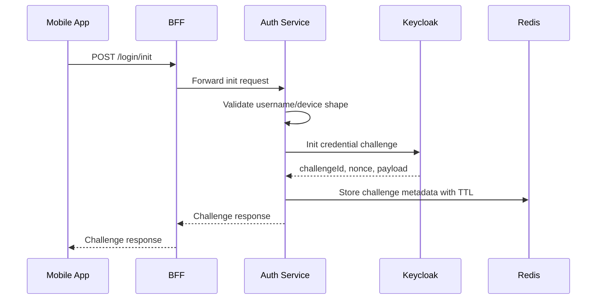
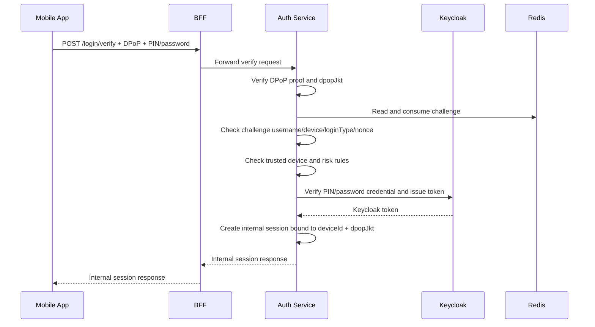
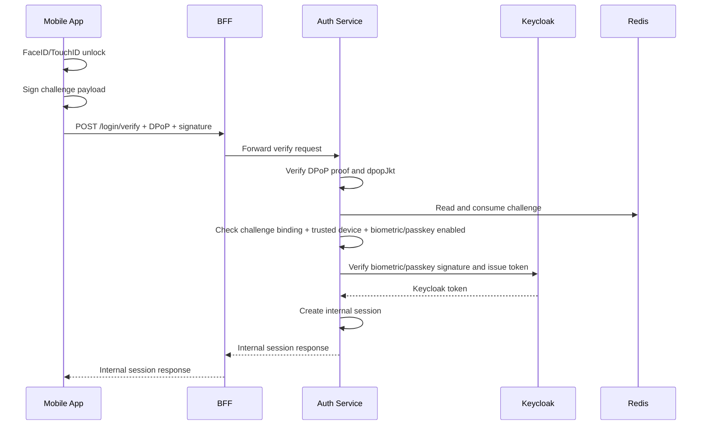
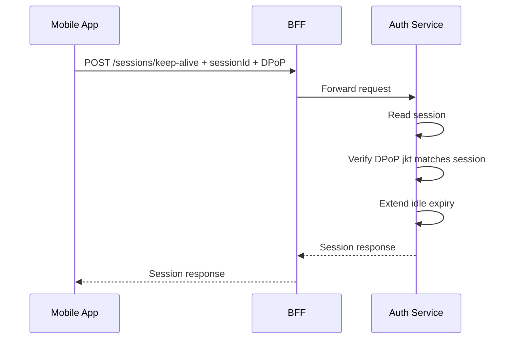
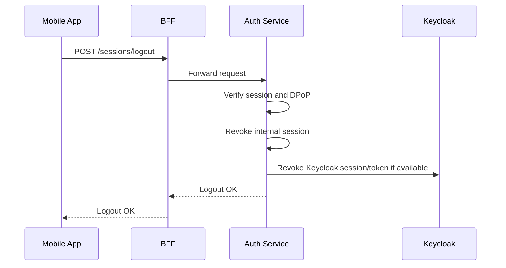
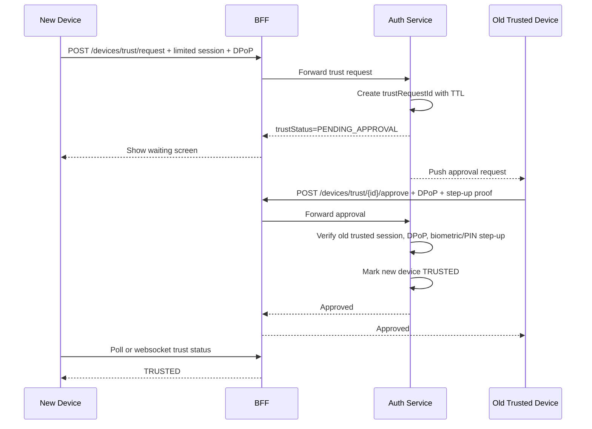
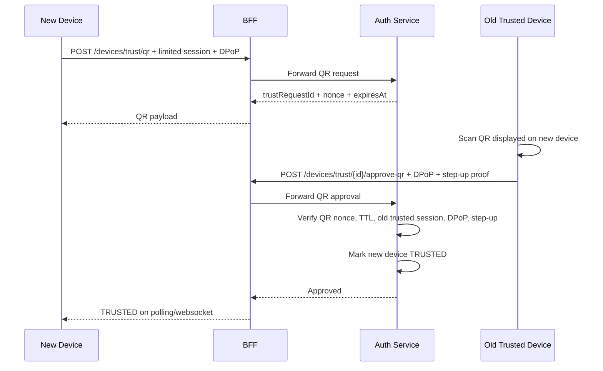

# Auth Login Challenge Flow Design

## Goal

Move login flows to a challenge-based model where Keycloak owns user credentials and Auth owns banking-specific controls:

- Keycloak stores and verifies credential material: password, PIN as `tsb-pin`, biometric/passkey public credential.
- Auth owns internal session, trusted device, DPoP binding, risk checks, and service entitlement context.
- BFF is the public API boundary and forwards calls to Auth/Keycloak. BFF does not verify credentials.
- Keycloak does not call Auth back during login. Auth verifies login context first, then asks Keycloak to verify the credential and mint a token.

Server-signed challenge is out of scope for this phase. Use TLS/certificate pinning plus DPoP nonce/challenge instead.

## Actors

```text
Mobile App
BFF
Auth Service
Keycloak
Redis
```

## API Summary

```text
POST /bff/api/auth/v1/login/init
POST /bff/api/auth/v1/login/verify
POST /bff/api/auth/v1/sessions/keep-alive
POST /bff/api/auth/v1/sessions/logout
```

## Common Concepts

### DPoP

The app owns a DPoP key pair:

```text
private key: Keychain/Secure Enclave, never leaves device
public key: sent as JWK
dpopJkt: JWK thumbprint
```

For sensitive login calls, app sends:

```text
DPoP: <proof JWT>
```

Server validates:

```text
signature
htm
htu
iat freshness
jti replay
nonce if required
jwk thumbprint == request/session dpopJkt
```

### Request Checksum

Do not add a separate `checksum` field in the request body.

If request body integrity is needed beyond TLS, add a body hash claim inside the DPoP proof:

```json
{
  "body_hash": "base64url(sha256(canonicalRequestBody))"
}
```

Phase one can skip `body_hash`; add it later for high-risk endpoints such as transfer confirm.

## Login Init

### Request

```http
POST /bff/api/auth/v1/login/init
Content-Type: application/json
```

```json
{
  "loginType": "BIOMETRIC",
  "username": "84901234567",
  "deviceId": "dev_xxx",
  "dpopJkt": "client_dpop_thumbprint"
}
```

Supported `loginType`:

```text
PASSWORD
PIN
BIOMETRIC
PASSKEY
```

### Response

```json
{
  "challengeId": "chal_xxx",
  "nonce": "nonce_xxx",
  "payload": "chal_xxx.nonce_xxx.84901234567.dev_xxx",
  "expiresInSeconds": 120,
  "availableMethods": ["BIOMETRIC", "PIN"],
  "trustedDeviceRequired": true
}
```

### Flow



## Login Verify: PIN or Password

### Request

```http
POST /bff/api/auth/v1/login/verify
Content-Type: application/json
DPoP: <proof>
```

```json
{
  "loginType": "PIN",
  "username": "84901234567",
  "deviceId": "dev_xxx",
  "challengeId": "chal_xxx",
  "nonce": "nonce_xxx",
  "pin": "123456",
  "dpopJkt": "client_dpop_thumbprint"
}
```

For password login:

```json
{
  "loginType": "PASSWORD",
  "username": "84901234567",
  "deviceId": "dev_xxx",
  "challengeId": "chal_xxx",
  "nonce": "nonce_xxx",
  "password": "secret",
  "dpopJkt": "client_dpop_thumbprint"
}
```

PIN login uses Keycloak custom grant `grant_type=tsb-pin`.
Password login stays on Keycloak default password grant. During onboarding, the system stores the user PIN as `tsb-pin`; the default password is generated separately for the future SMS/password flow.

### Response

```json
{
  "sessionId": "ses_xxx",
  "expiresInSeconds": 600,
  "subject": "kc-sub",
  "username": "84901234567",
  "deviceId": "dev_xxx",
  "trustedDevice": true,
  "roles": ["CUSTOMER"]
}
```

### Flow



## Login Verify: Biometric

### Request

```http
POST /bff/api/auth/v1/login/verify
Content-Type: application/json
DPoP: <proof>
```

```json
{
  "loginType": "BIOMETRIC",
  "username": "84901234567",
  "deviceId": "dev_xxx",
  "challengeId": "chal_xxx",
  "nonce": "nonce_xxx",
  "signature": "base64_signature",
  "dpopJkt": "client_dpop_thumbprint"
}
```

The app signs `payload` from `/login/init` using the biometric/passkey private key.

### Flow



No callback is used from Keycloak to Auth. Challenge consumption, trusted-device checks, and biometric/passkey-enabled checks happen in Auth before the Keycloak grant request.

## Keep Alive

### Request

```http
POST /bff/api/auth/v1/sessions/keep-alive
X-Session-Id: <sessionId>
DPoP: <proof>
```

### Flow



## Logout

### Request

```http
POST /bff/api/auth/v1/sessions/logout
X-Session-Id: <sessionId>
DPoP: <proof>
```

### Flow



## Untrusted Device Login

Login can succeed even when the current device is not trusted. In that case Auth creates a limited session.

### Response Additions

```json
{
  "sessionId": "ses_xxx",
  "trustedDevice": false,
  "deviceId": "dev_new",
  "trustStatus": "UNTRUSTED",
  "allowedActions": ["VIEW_LIMITED", "REQUEST_DEVICE_TRUST"],
  "riskLevel": "MEDIUM"
}
```

Recommended rules:

```text
UNTRUSTED device:
  allow limited profile/account view
  allow request-device-trust flow
  block transfer/payment/biometric-enable/security changes

TRUSTED device:
  allow normal banking features subject to entitlement and MFA policy
```

Domain services can later enforce this with a dedicated annotation:

```java
@RequireTrustedDevice
@RequireEntitlement("TRANSFER_CREATE")
```

## Trusted Device Model

Users should be allowed to have multiple trusted devices, but with a configured limit.

Recommended default:

```yaml
auth:
  trusted-device:
    max-per-customer: 3
```

Device states:

```text
UNTRUSTED
PENDING_TRUST
TRUSTED
REVOKED
LOST
SUSPENDED
```

Rules:

```text
1. First device becomes trusted after successful onboarding/eKYC.
2. New device login can create a limited session with trustedDevice=false.
3. New device trust requires approval from an existing trusted device or recovery flow.
4. User can list and revoke trusted devices.
5. Revoking a device revokes its sessions and credentials.
6. If max trusted devices is reached, user must revoke an old trusted device first.
```

## Device Key And Credential Model

DPoP and biometric/passkey credentials are per device, not global per user.

```text
customer/user
  └── trusted devices [n]
        ├── dpop_public_key / dpop_jkt
        ├── biometric credential(s)
        ├── passkey credential(s)
        └── sessions
```

Suggested metadata:

```text
auth_device
- device_id
- user_id / customer_id
- device_name
- platform
- trust_status
- dpop_jkt
- dpop_public_key
- trusted_at
- revoked_at
- created_at
- updated_at
```

```text
auth_device_credential
- credential_id
- device_id
- credential_type        -- BIOMETRIC | PASSKEY
- public_key
- algorithm
- counter
- status                 -- ACTIVE | REVOKED
- created_at
- last_used_at
```

```text
auth_session
- session_id_hash
- user_id
- device_id
- dpop_jkt
- trusted_device
- status
- idle_expires_at
- absolute_expires_at
```

Rules:

```text
DPoP key belongs to one device.
Biometric key belongs to one device.
Passkey credential belongs to one authenticator/device.
Session is bound to deviceId + dpopJkt.
Do not reuse DPoP or biometric keys across devices.
```

## Trust New Device Flow: Old Device Approval



Approval screen on old device should show:

```text
New device name
Platform
IP/geo approximation
Time
Risk level
Approve / Reject
```

Approval must require step-up on the old trusted device:

```text
biometric or PIN
DPoP proof from old device
```

## Trust New Device Flow: QR Approval



QR payload should only contain short-lived data:

```json
{
  "trustRequestId": "trq_xxx",
  "nonce": "nonce_xxx",
  "expiresAt": "2026-10-03T10:00:00Z"
}
```

Recommended TTL:

```text
2 minutes
```

## Recovery Without Old Trusted Device

If the user has no old trusted device:

```text
eKYC recovery
OTP + PIN + liveness
backoffice/call-center approval for high-risk cases
cooldown period for high-value transfers
```

Do not auto-trust a new device by PIN/password login alone.

## Risk Management

Phase one should keep risk logic inside Auth as a hexagonal module:

```text
auth/risk
```

Do not extract a separate risk service yet. Extract later when transfer/payment/card also need shared scoring, feature store, or ML/rule-engine operations.

Risk inputs:

```text
deviceId
trustedDevice
device fingerprint
ip / geo
login velocity
failed attempts
session age
dpop verified
biometric enabled
transfer amount
beneficiary age
```

Risk output:

```json
{
  "riskLevel": "LOW|MEDIUM|HIGH|BLOCK",
  "requiredActions": ["TRUSTED_DEVICE", "BIOMETRIC_STEP_UP"],
  "allowedMethods": ["OLD_DEVICE_APPROVAL", "QR_APPROVAL", "EKYC_RECOVERY"]
}
```

Risk usage:

```text
login: allow, block, captcha, or step-up
trust device: choose old-device approval, QR approval, or eKYC recovery
transfer/payment: choose required confirmation methods
```

## App UI/UX Design

### Login Screen

Keep the first screen focused:

```text
Username / phone
Primary action: Continue
Secondary methods shown after username/device state is known
```

Recommended layout:

```text
Top:
  Bank name/logo

Main:
  Phone/username input
  Continue button

After init:
  PIN input OR FaceID button OR Passkey button
  Method switcher if multiple methods are available

Bottom:
  API Logs button for demo builds
  Environment/backend indicator for demo builds
```

### Login Init UX

When user taps Continue:

```text
1. Disable button
2. Show inline loading: "Đang kiểm tra thiết bị..."
3. Call /login/init
4. Render allowed methods from response
```

Do not ask FaceID before `/login/init`; the server challenge must exist first.

### Biometric UX

Recommended behavior:

```text
Show "Đăng nhập bằng FaceID/TouchID"
Tap button
Call /login/init if needed
Open FaceID prompt
Sign challenge
Call /login/verify
```

Failure handling:

```text
User cancel: keep user on login screen, show small message.
FaceID fail once: allow retry.
FaceID fail twice: suggest PIN, but do not hide biometric button.
Biometric locked: show message to unlock phone with passcode or use PIN.
Server reject: show "Thiết bị chưa được tin cậy hoặc sinh trắc học chưa được bật."
```

### PIN UX

```text
Use 6-digit PIN input
Auto-submit only after 6 digits if API is idle
Allow backspace and clear
Show "Quên PIN?" as secondary action, not primary
```

### Trusted Device UX

After successful login on an untrusted device:

```text
Show prompt: "Tin cậy thiết bị này?"
Explain: "Dùng để bật đăng nhập nhanh và tăng bảo mật DPoP."
Actions:
  Trust this device
  Not now
```

Do not auto-enable biometric just because the device is trusted. Biometric enable must be a separate explicit user action.

### API Logs UX

For demo builds:

```text
Top-right API Logs button
Show pending request immediately
Replace pending entry when response arrives
Show method, URL, request headers, request body, status, response body
No masking in demo mode if explicitly configured
```

### Error Messages

Use friendly messages:

```text
Invalid credential:
  "Thông tin đăng nhập không đúng."

Device not trusted:
  "Thiết bị chưa được tin cậy. Vui lòng đăng nhập bằng PIN trước."

Challenge expired:
  "Phiên xác thực đã hết hạn. Vui lòng thử lại."

DPoP/device mismatch:
  "Thiết bị xác thực không khớp. Vui lòng đăng nhập lại."
```

## Implementation Notes

- Keycloak owns credential verification.
- Auth never stores PIN/password/biometric private material.
- Auth may store device metadata, DPoP thumbprint, and session metadata.
- Biometric/passkey private key stays on device.
- Multiple trusted devices are allowed, but each device has its own DPoP key and credential records.
- New device login returns `trustedDevice=false` until the trust flow completes.
- Trusting a new device requires old trusted device approval, QR approval, or recovery.
- Risk management stays inside Auth in phase one.
- BFF strips untrusted client-supplied internal auth headers.
- BFF signs internal `X-Auth-*` headers to downstream services.
