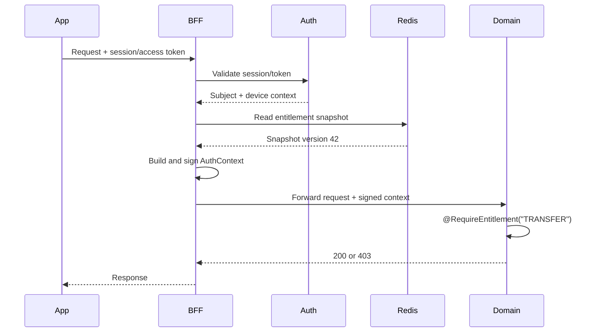

# Entitlement Design

## 1. Goal

Entitlement answers whether a subject is allowed to perform an operation.

```text
customer -> service package -> entitlement group -> operation
staff/client/system -> role/system -> entitlement group -> operation
```

Authentication identifies the subject; entitlement determines what the subject may do. Operations are independent, for example `TRANSFER`, `TRANSFER_GLOBAL`, `PAYMENT`; one operation does not automatically grant another operation.

## 2. Decision Rules

Authorization uses default-deny:

```text
explicit user deny > explicit user allow > package/group deny > package/group allow > default deny
```

Groups have parent-child relationships, but permissions in a parent group do not automatically grant operations from a child group. A group can have many operations, and an operation can belong to many groups.

To reduce data, a package/group may use a deny-list for operations that are forbidden within a standard operation set. The engine remains default-deny; a deny-list does not become a system-wide allow.

## 3. Schema DB

### `entitlement_operation`

```text
id, code(unique), name, domain, description, status, version, created_at, updated_at
```

### `entitlement_group`

```text
id, code(unique), name, parent_id(nullable FK), status, version, created_at, updated_at
```

### `entitlement_group_operation`

```text
group_id(FK), operation_id(FK), effect(ALLOW/DENY), created_at
unique(group_id, operation_id)
```

### `service_package`

```text
id, code(unique), name, status, version, created_at, updated_at
```

### `service_package_group`

```text
service_package_id(FK), group_id(FK), effect(ALLOW/DENY), created_at
unique(service_package_id, group_id)
```

### `customer_service_package`

```text
customer_id, service_package_id(FK), status,
effective_from, effective_to(nullable), created_at, updated_at
```

When customer onboarding completes, the system automatically assigns the `STANDARD` service package. This package is linked to the
`STANDARD` group; the default group does not have operations yet, and permissions will be added later through the entitlement catalog.

Keycloak only manages identity/credentials. Service packages, operations and Common configuration belong to the `entitlementdb` database, the only database owned by Common; the Redis auth session
only keeps the `customerId` and `servicePackages` projection so BFF can look up metadata quickly.

### `principal_entitlement_group`

Used for staff, client and system:

```text
principal_type, principal_id, group_id(FK), effect(ALLOW/DENY),
effective_from, effective_to(nullable), created_at
```

### `user_entitlement_override`

Used for custom permissions for each customer/user:

```text
subject_type, subject_id, operation_id(FK), effect(ALLOW/DENY),
reason, approved_by, effective_from, effective_to, version, created_at, updated_at
```

Custom permissions must have an actor, reason, duration and revocation capability. Clients are not allowed to create overrides themselves.

### `entitlement_audit_log`

```text
id, subject_type, subject_id, operation, target_type, target_id,
old_value(json), new_value(json), actor_id, trace_id, created_at
```

Every operation, group, package and override change must be audited.

## 4. Snapshot and Cache

Sample customer snapshot:

```json
{
  "subjectId": "customer-123",
  "subjectType": "CUSTOMER",
  "version": 42,
  "allow": ["ACCOUNT_VIEW", "TRANSFER"],
  "deny": ["TRANSFER_GLOBAL"],
  "expiresAt": "2026-10-04T12:00:00Z"
}
```

The snapshot is only a cache and does not replace the source DB.

The finalized cache architecture is split into two layers:

- **L1 BFF**: caches role/service package entitlement metadata, including groups and concrete operations.
- **L2 Redis**: caches the session projection, including subject, role and service package; it does not need to store the full operation list.

BFF looks up the session in L2, looks up corresponding metadata in L1, merges operations, then attaches them to signed headers before forwarding to the domain.

```text
L1 BFF:    bff:entitlement:metadata:package:{packageCode}:{version}
L1 BFF:    bff:entitlement:metadata:role:{roleCode}:{version}
Redis L2:  auth:session:{sessionId}
```

When permissions change:

1. Write the DB in a transaction.
2. Increment the version.
3. Write outbox/event.
4. Publish Redis/Kafka event.
5. BFF instances invalidate affected L1 metadata.
6. Subsequent requests read the new snapshot.

Do not kick sessions only because entitlements changed. Redis errors or cache misses must fail closed for sensitive operations.

Sample event:

```json
{
  "eventType": "ENTITLEMENT_CHANGED",
  "subjectType": "CUSTOMER",
  "subjectId": "customer-123",
  "scopeType": "SERVICE_PACKAGE",
  "scopeId": "premium",
  "version": 43,
  "changedOperations": ["TRANSFER", "TRANSFER_GLOBAL"]
}
```

## 5. BFF and Domain Context

### 5.1 Entitlement enrichment

BFF is the enrichment layer before forwarding requests to the domain. After validating the session/token, BFF reads the session projection from L2, gets role/service package, looks up operation metadata from L1, merges allow/deny, validates version/expiry, and only then creates a signed auth context. BFF does not accept entitlement headers from clients.

Implementation details, cache, failure policy and test matrix are in [entitlement-enrichment-implementation-plan.md](entitlement-enrichment-implementation-plan.md).

BFF removes auth headers sent by the client, creates a new context and signs it with internal HMAC:

```text
X-Auth-Subject-Id
X-Auth-Subject-Type
X-Auth-User-Id
X-Auth-Roles
X-Auth-Entitlement-Version
X-Auth-Entitlements or X-Auth-Entitlement-Ref
X-Auth-Trusted-Device
X-Auth-Context-Timestamp
X-Auth-Context-Id
X-Auth-Signature
```

Recommended to use `X-Auth-Entitlement-Ref` when the permission list is large. The minimum HMAC payload includes method, path, trace id, subject id, entitlement version, timestamp and context id.

Domain only trusts the context when the signature is valid, the timestamp is still valid, the context id has not been replayed and the snapshot has not expired.

## 6. Domain Annotation

Sharedpackage provides:

```java
@RequireEntitlement("TRANSFER")
public TransferResponse transfer(TransferCommand command) {
    return transferService.execute(command);
}
```

Can be combined with:

```java
@RequireRole("CUSTOMER")
@RequireEntitlement("TRANSFER")
@RequireTrustedDevice
```

Interceptor/AOP will read the verified `AuthContext`, check subject, signature, version, expiry and allow/deny snapshot.

Missing auth context returns `401`; having a context but missing entitlement returns `403`.

```text
AUTH_CONTEXT_MISSING
AUTH_CONTEXT_INVALID
ENTITLEMENT_DENIED
ENTITLEMENT_EXPIRED
ENTITLEMENT_VERSION_STALE
```

## 7. Expected API

```text
GET    /common/api/entitlements/operations
GET    /common/api/entitlements/groups
GET    /common/api/entitlements/metadata/packages/{packageCode}
GET    /common/api/entitlements/metadata/roles/{roleCode}
GET    /common/api/service-packages/{packageCode}
GET    /common/api/subjects/{type}/{id}/entitlements
POST   /common/api/entitlements/operations
POST   /common/api/entitlements/groups
PUT    /common/api/entitlements/groups/{id}
POST   /common/api/entitlements/groups/{id}/operations
DELETE /common/api/entitlements/groups/{id}/operations/{operation}
POST   /common/api/service-packages
POST   /common/api/service-packages/{id}/groups
POST   /common/api/customers/{id}/service-packages
POST   /common/api/subjects/{type}/{id}/overrides
DELETE /common/api/subjects/{type}/{id}/overrides/{overrideId}
```

Administrative APIs need admin authorization, optimistic version checks, audit logs and idempotency for write commands.

## 8. Flow



## 9. Implementation Scope

### Phase 1

- Schema operation/group/service package.
- Customer package assignment.
- Snapshot entitlement.
- BFF L1/L2 cache and signed auth context.
- `@RequireEntitlement` in sharedpackage.
- One demo endpoint `TRANSFER`.

### Phase 2

- Full group hierarchy.
- Staff/client/system binding.
- Custom override with approval, expiry and revoke.
- Redis invalidation event.
- Audit metrics/dashboard.

### Phase 3

- Policy versioning/rollback.
- Delegated administration.
- Bulk assignment.
- Explain decision API.

## 10. Acceptance criteria

- Client cannot spoof entitlement headers.
- With the appropriate package, the operation succeeds.
- Without permission, return `403 ENTITLEMENT_DENIED`.
- User deny wins over package allow.
- Changing a package updates BFF L1 caches without logout.
- Cache miss/Redis down does not unintentionally grant permissions.
- Domain checks permissions through annotations.
- Every permission change has an audit log and trace id.
