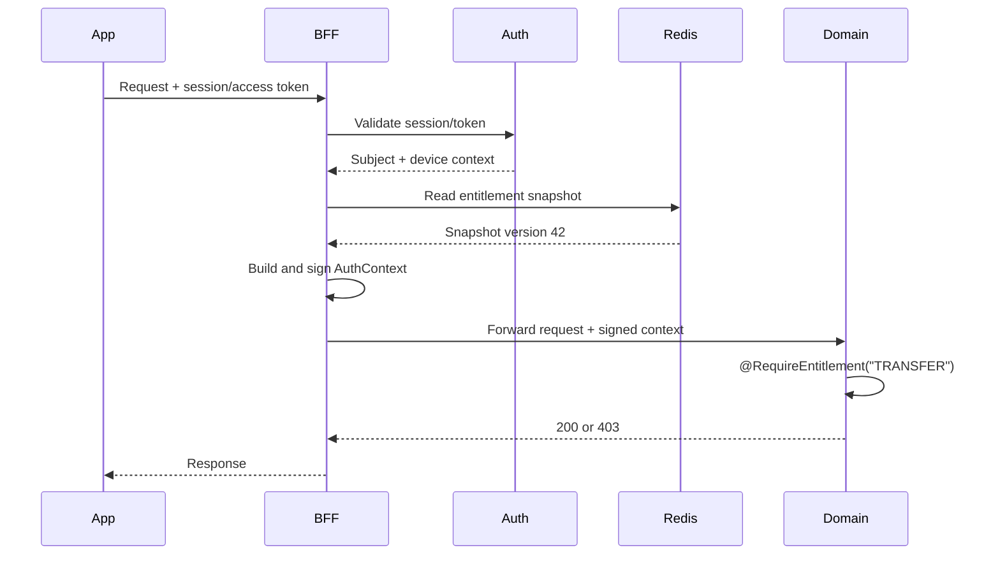

# Entitlement Design

## 1. Mục tiêu

Entitlement trả lời câu hỏi một subject có được thực hiện một operation hay không.

```text
customer -> service package -> entitlement group -> operation
staff/client/system -> role/system -> entitlement group -> operation
```

Authentication xác định subject; entitlement xác định subject được làm gì. Operation độc lập, ví dụ `TRANSFER`, `TRANSFER_GLOBAL`, `PAYMENT`; có một operation không tự cấp operation khác.

## 2. Quy tắc quyết định

Authorization dùng default-deny:

```text
explicit user deny > explicit user allow > package/group deny > package/group allow > default deny
```

Group có quan hệ cha-con nhưng quyền ở group cha không tự động cấp operation của group con. Một group có thể có nhiều operation và một operation có thể thuộc nhiều group.

Để giảm dữ liệu, package/group có thể dùng deny-list cho các operation bị cấm trong một bộ operation chuẩn. Engine vẫn default-deny; deny-list không biến thành allow toàn hệ thống.

## 3. Schema DB

### `entitlement_operation`

```text
id, code(unique), name, domain, description, status, version, created_at, updated_at
```

### `entitlement_group`

```text
id, code(unique), name, parent_id(nullable FK), status, version, created_at, updated_at
```

### `entitlement_group_operation`

```text
group_id(FK), operation_id(FK), effect(ALLOW/DENY), created_at
unique(group_id, operation_id)
```

### `service_package`

```text
id, code(unique), name, status, version, created_at, updated_at
```

### `service_package_group`

```text
service_package_id(FK), group_id(FK), effect(ALLOW/DENY), created_at
unique(service_package_id, group_id)
```

### `customer_service_package`

```text
customer_id, service_package_id(FK), status,
effective_from, effective_to(nullable), created_at, updated_at
```

Khi onboarding customer hoàn tất, hệ thống tự gán service package `STANDARD`. Package này liên kết với group
`STANDARD`; group mặc định chưa có operation và quyền sẽ được bổ sung qua entitlement catalog sau.

Keycloak chỉ quản lý identity/credential. Service package, operation và Config của Common thuộc database `entitlementdb`, là database duy nhất do Common sở hữu; Redis auth session
chỉ giữ projection `customerId` và `servicePackages` để BFF tra metadata nhanh.

### `principal_entitlement_group`

Dùng cho staff, client và system:

```text
principal_type, principal_id, group_id(FK), effect(ALLOW/DENY),
effective_from, effective_to(nullable), created_at
```

### `user_entitlement_override`

Dùng cho quyền custom của từng customer/user:

```text
subject_type, subject_id, operation_id(FK), effect(ALLOW/DENY),
reason, approved_by, effective_from, effective_to, version, created_at, updated_at
```

Custom permission phải có actor, lý do, thời hạn và khả năng revoke. Client không được tự tạo override.

### `entitlement_audit_log`

```text
id, subject_type, subject_id, operation, target_type, target_id,
old_value(json), new_value(json), actor_id, trace_id, created_at
```

Mọi thay đổi operation, group, package và override đều phải audit.

## 4. Snapshot và cache

Snapshot customer mẫu:

```json
{
  "subjectId": "customer-123",
  "subjectType": "CUSTOMER",
  "version": 42,
  "allow": ["ACCOUNT_VIEW", "TRANSFER"],
  "deny": ["TRANSFER_GLOBAL"],
  "expiresAt": "2026-10-04T12:00:00Z"
}
```

Snapshot chỉ là cache, không thay thế DB nguồn.

Kiến trúc cache chốt tách thành hai lớp:

- **L1 BFF**: cache metadata entitlement của role/service package, gồm group và operation cụ thể.
- **L2 Redis**: cache session projection gồm subject, role và service package; không cần lưu toàn bộ operation list.

BFF lookup session trong L2, lookup metadata tương ứng trong L1, merge operation rồi gắn vào signed header trước khi forward xuống domain.

```text
L1 BFF:    bff:entitlement:metadata:package:{packageCode}:{version}
L1 BFF:    bff:entitlement:metadata:role:{roleCode}:{version}
Redis L2:  auth:session:{sessionId}
```

Khi quyền thay đổi:

1. Ghi DB trong transaction.
2. Tăng version.
3. Ghi outbox/event.
4. Publish Redis/Kafka event.
5. Các BFF instance invalidate metadata L1 bị ảnh hưởng.
6. Request sau đọc snapshot mới.

Không kick session chỉ vì entitlement đổi. Redis lỗi hoặc cache miss phải fail closed với operation nhạy cảm.

Event mẫu:

```json
{
  "eventType": "ENTITLEMENT_CHANGED",
  "subjectType": "CUSTOMER",
  "subjectId": "customer-123",
  "scopeType": "SERVICE_PACKAGE",
  "scopeId": "premium",
  "version": 43,
  "changedOperations": ["TRANSFER", "TRANSFER_GLOBAL"]
}
```

## 5. BFF và domain context

### 5.1 Entitlement enrichment

BFF là lớp enrichment trước khi forward request xuống domain. Sau khi xác thực session/token, BFF đọc session projection từ L2, lấy role/service package, lookup operation metadata từ L1, merge allow/deny, validate version/expiry rồi mới tạo signed auth context. BFF không nhận entitlement header từ client.

Chi tiết implementation, cache, failure policy và test matrix nằm trong [entitlement-enrichment-implementation-plan.md](entitlement-enrichment-implementation-plan.md).

BFF xóa các header auth do client gửi, tạo context mới và ký bằng HMAC nội bộ:

```text
X-Auth-Subject-Id
X-Auth-Subject-Type
X-Auth-User-Id
X-Auth-Roles
X-Auth-Entitlement-Version
X-Auth-Entitlements hoặc X-Auth-Entitlement-Ref
X-Auth-Trusted-Device
X-Auth-Context-Timestamp
X-Auth-Context-Id
X-Auth-Signature
```

Khuyến nghị dùng `X-Auth-Entitlement-Ref` khi danh sách quyền lớn. Payload HMAC tối thiểu gồm method, path, trace id, subject id, entitlement version, timestamp và context id.

Domain chỉ tin context khi chữ ký hợp lệ, timestamp còn hiệu lực, context id chưa replay và snapshot chưa hết hạn.

## 6. Annotation domain

Sharedpackage cung cấp:

```java
@RequireEntitlement("TRANSFER")
public TransferResponse transfer(TransferCommand command) {
    return transferService.execute(command);
}
```

Có thể kết hợp:

```java
@RequireRole("CUSTOMER")
@RequireEntitlement("TRANSFER")
@RequireTrustedDevice
```

Interceptor/AOP sẽ đọc verified `AuthContext`, kiểm tra subject, chữ ký, version, expiry và allow/deny snapshot.

Thiếu auth context trả `401`; có context nhưng thiếu entitlement trả `403`.

```text
AUTH_CONTEXT_MISSING
AUTH_CONTEXT_INVALID
ENTITLEMENT_DENIED
ENTITLEMENT_EXPIRED
ENTITLEMENT_VERSION_STALE
```

## 7. API dự kiến

```text
GET    /common/api/entitlements/operations
GET    /common/api/entitlements/groups
GET    /common/api/entitlements/metadata/packages/{packageCode}
GET    /common/api/entitlements/metadata/roles/{roleCode}
GET    /common/api/service-packages/{packageCode}
GET    /common/api/subjects/{type}/{id}/entitlements
POST   /common/api/entitlements/operations
POST   /common/api/entitlements/groups
PUT    /common/api/entitlements/groups/{id}
POST   /common/api/entitlements/groups/{id}/operations
DELETE /common/api/entitlements/groups/{id}/operations/{operation}
POST   /common/api/service-packages
POST   /common/api/service-packages/{id}/groups
POST   /common/api/customers/{id}/service-packages
POST   /common/api/subjects/{type}/{id}/overrides
DELETE /common/api/subjects/{type}/{id}/overrides/{overrideId}
```

API quản trị cần admin authorization, optimistic version check, audit log và idempotency cho các lệnh ghi.

## 8. Flow



## 9. Phạm vi triển khai

### Phase 1

- Schema operation/group/service package.
- Customer package assignment.
- Snapshot entitlement.
- BFF L1/L2 cache và signed auth context.
- `@RequireEntitlement` trong sharedpackage.
- Một endpoint demo `TRANSFER`.

### Phase 2

- Group hierarchy đầy đủ.
- Staff/client/system binding.
- Custom override có approval, expiry và revoke.
- Redis invalidation event.
- Audit metrics/dashboard.

### Phase 3

- Policy versioning/rollback.
- Delegated administration.
- Bulk assignment.
- Explain decision API.

## 10. Acceptance criteria

- Client không thể giả mạo entitlement header.
- Có package phù hợp thì operation thành công.
- Không có quyền trả `403 ENTITLEMENT_DENIED`.
- User deny thắng package allow.
- Đổi package cập nhật các BFF L1 mà không logout.
- Cache miss/Redis down không mở quyền ngoài ý muốn.
- Domain kiểm tra quyền bằng annotation.
- Mọi thay đổi quyền có audit log và trace id.
