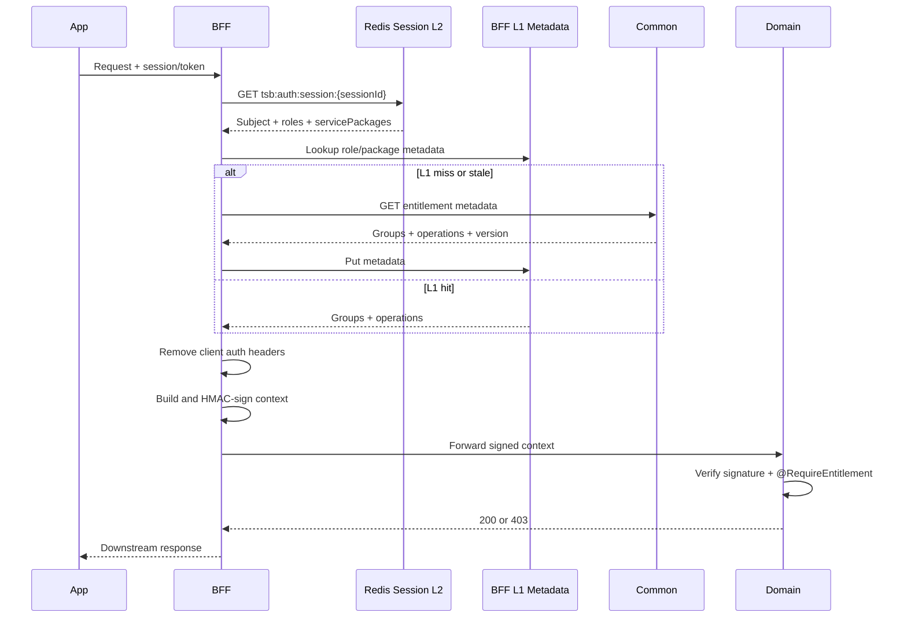

# Entitlement Enrichment Implementation Plan

## 1. Goal

When a request passes through BFF, BFF must fetch the subject's latest entitlement, create a trusted authorization context, sign the context and forward it to the domain. Domain only reads the `AuthContext` that has been verified by sharedpackage; clients cannot send or modify entitlement headers themselves.

```text
App/Portal
  -> BFF authenticate session/token
  -> BFF read Auth session object directly from Redis
  -> BFF lookup role/package metadata in L1
  -> BFF merge concrete operations
  -> BFF sign internal auth context
  -> Domain verify signature
  -> @RequireEntitlement authorize
```

## 2. Scope

### Included

- Resolve entitlements by joining role/service package in L2 with operation metadata in L1.
- Read role/service package metadata from Common through service discovery/HTTP client.
- Cache L1 in each BFF instance and L2 Redis.
- Forward `allow`, `deny`, `version`, `expiresAt` through signed internal headers.
- Deny precedence and fail-closed for sensitive APIs.
- Invalidate cache when entitlements change.
- Metrics, trace, audit log and demo API with `@RequireEntitlement`.

### Not Included

- Business logic in BFF.
- BFF calculating the package/group graph itself.
- Storing entitlements in the BFF database.
- Kicking sessions when permissions change.

## 3. Final Cache Model

### L1: entitlement metadata

L1 stores entitlement metadata by `servicePackage` or `role`; it does not store user/session data. Metadata includes groups and concrete operations:

```json
{
  "servicePackage": "PREMIUM",
  "version": 12,
  "groups": [{"code": "PAYMENTS", "operations": ["PAYMENT", "TRANSFER"]}],
  "allow": ["PAYMENT", "TRANSFER"],
  "deny": [],
  "expiresAt": "2026-10-04T12:00:00Z"
}
```

```text
L1: bff:entitlement:metadata:package:{packageCode}:{version}
L1: bff:entitlement:metadata:role:{roleCode}:{version}
```

### L2: Auth session object

L2 is the session object issued and owned by Auth. BFF only reads Redis directly by `sessionId` to get
subject, role and service package; BFF does not call the Auth introspection API and does not create another projection.

```json
{
  "sessionId": "sid-123",
  "subject": "keycloak-subject-id",
  "customerId": "customer-001",
  "username": "customer-name",
  "deviceId": "device-001",
  "dpopJkt": "device-key-thumbprint",
  "trustedDevice": true,
  "roles": [],
  "servicePackages": ["PREMIUM"],
  "createdAt": "2026-10-04T11:50:00Z",
  "expiresAt": "2026-10-04T12:00:00Z"
}
```

```text
L2: tsb:auth:session:{sessionId}
```

Resolution:

```text
sessionId -> L2 session -> roles/servicePackages -> L1 metadata
           -> merge operations -> signed header -> domain annotation
```

## 4. Contract Common

BFF calls Common through a downstream client to fetch entitlement metadata:

```http
GET /common/api/entitlements/metadata/packages/{packageCode}
GET /common/api/entitlements/metadata/roles/{roleCode}
```

Standard response:

```json
{
  "success": true,
  "data": {
    "scopeType": "SERVICE_PACKAGE",
    "scopeId": "PREMIUM",
    "version": 12,
    "groups": [{"code": "PAYMENTS", "operations": ["PAYMENT", "TRANSFER"]}],
    "allow": ["ACCOUNT_VIEW", "TRANSFER"],
    "deny": ["TRANSFER_GLOBAL"],
    "expiresAt": "2026-10-04T12:00:00Z"
  }
}
```

Common is the source of truth for metadata. Common may materialize metadata from package/group/override; BFF only merges the returned metadata and does not access the DB directly or calculate the business graph itself.

## 5. BFF resolution flow

1. Receive mobile `sessionId` or portal token.
2. For mobile, read the session object in Redis at `tsb:auth:session:{sessionId}` and check `sessionId`, TTL, `expiresAt`.
3. Get subject, roles and service packages from the session.
4. Look up metadata for each role/service package in L1.
5. If L1 misses/is stale, call Common to fetch metadata and write it back to L1.
6. Merge operations; deny always has precedence.
7. Remove all entitlement headers sent by the client.
8. Attach the operation list to the signed auth context.
9. Sign the request and forward it to the domain.



## 5. Header contract

BFF creates and signs:

```http
X-Auth-Subject-Type: CUSTOMER
X-Auth-Subject-Id: customer-001
X-Auth-Entitlements: ACCOUNT_VIEW,TRANSFER
X-Auth-Entitlement-Deny: TRANSFER_GLOBAL
X-Auth-Entitlement-Version: 42
X-Auth-Entitlement-Expires-At: 2026-10-04T12:00:00Z
X-Auth-Timestamp: 2026-10-04T10:00:00Z
X-Auth-Nonce: <unique-value>
X-Auth-Signature: <hmac>
```

Client-supplied versions of these headers are always removed. The canonical signature includes method, request path, subject, entitlement lists, version, expiry, timestamp and nonce.

For a large entitlement list, phase two may replace lists with a signed reference:

```http
X-Auth-Entitlement-Ref: entitlement:subject:CUSTOMER:customer-001:42
```

Domain must still verify the reference/version against a trusted resolver; it must not trust a raw client-provided reference.

## 7. Cache and invalidation

Keys:

```text
L1: bff:entitlement:metadata:package:{packageCode}:{version}
L1: bff:entitlement:metadata:role:{roleCode}:{version}
L2: tsb:auth:session:{sessionId}
```

Rules:

- L1 metadata TTL short, for example 30-60 seconds, and version-aware.
- L2 session TTL is managed by Auth and must match `expiresAt` in the session object.
- BFF only reads L2; Auth is responsible for creating, keep-alive, trusted device, revoke and session deletion.
- Newer metadata version replaces older version only.
- Never serve expired metadata for sensitive operations.
- Entitlement changes do not revoke sessions.
- Common publishes `ENTITLEMENT_METADATA_CHANGED` through Redis/Kafka.
- Every BFF instance invalidates affected role/package metadata in L1.
- A service package change invalidates one metadata entry, not every user session.

## 8. Failure policy

| Situation | Non-sensitive API | Sensitive API |
|---|---|---|
| Snapshot not found | `403 ENTITLEMENT_DENIED` | `403 ENTITLEMENT_DENIED` |
| Common unavailable | configurable `503` | fail closed, `503` or `403` |
| Snapshot expired | refresh once | reject |
| Invalid signature downstream | `401` | `401` |
| Missing operation | `403` | `403` |

BFF must not silently grant access when Common, Redis or snapshot validation fails.

## 9. Implementation steps

## 10. Current Implementation Status

### Implemented

- Common materializes service package metadata from package/group/operation bindings.
- Common exposes `GET /entitlements/admin/metadata/packages/{code}`.
- Auth session projection has `roles` and `servicePackages`, stored in Redis session JSON.
- Onboarding assigns the default `STANDARD` package, binds the Keycloak subject to the internal `customerId`, then updates the current session.
- On later logins, Auth resolves `customerId` from the identity link and hydrates packages from Common; Keycloak does not store authorization data.
- BFF reads the Auth session directly from Redis, caches package metadata in in-memory L1 with a 60-second TTL,
  merges operations and deny precedence.
- BFF signs internal auth headers using the actual downstream path before forwarding.
- Sharedpackage verifies the HMAC signature and supports `@RequireEntitlement`.
- Client demo has endpoint `GET /shared-test/entitlement/test2` requiring operation `TEST2`.
- Smoke tested through BFF with result `200` when `TEST2` is granted; package `STANDARD` has no operation yet, so it returns `403` as designed.

### Limits to Address in the Next Phase

- Role metadata and user override have not been added to the BFF resolver yet.
- L1 is currently a local cache in each BFF instance; there is no Redis/Kafka event invalidation across multiple instances yet.
- The Common metadata endpoint is using an internal admin key for smoke tests; production should replace it with internal service authentication.

### Step 1: sharedpackage contract

- Add immutable entitlement metadata/session projection model.
- Add `AuthContext` fields for allow, deny, version and expiry.
- Add canonical header constants.
- Include entitlement fields in `AuthHeaderSigner` and verifier.
- Extend `@RequireEntitlement` to deny when the requested operation is in deny list.
- Add tests for `ANY`, `ALL`, deny precedence, expired snapshot and missing context.

### Step 2: Common source API

- Add `GET /entitlements/metadata/packages/{code}`.
- Add `GET /entitlements/metadata/roles/{code}`.
- Add explicit metadata validation and version response.
- Add materialization/rebuild use case from package/group/override.
- Publish entitlement change event after committed writes.
- Add audit records and metrics for rebuild/publish.

### Step 3: BFF resolver

- Add `EntitlementResolver` port.
- Add Common HTTP adapter for role/service package metadata.
- Read session projection from Auth Redis L2.
- Add L1 metadata cache; do not copy the full operation list into the session.
- Add single-flight protection for concurrent metadata misses.
- Add request filter integration after session/token authentication.
- Strip spoofable headers before signing.

### Step 4: domain enforcement

- Add `@RequireEntitlement("TRANSFER")` to one demo endpoint.
- Verify signed context in sharedpackage.
- Return `403` with `ENTITLEMENT_DENIED`.
- Add trace attributes and metrics for allow/deny/cache hit/cache miss.

### Step 5: portal test workflow

- Create operation, group and package.
- Bind operation to group and group to package.
- Assign package to customer.
- Rebuild/upsert snapshot.
- Login as the customer through BFF.
- Call protected endpoint and inspect `200` or `403`.
- Change package, wait for/invoke invalidation, call again without logging out.

### 5.1 Entitlement Cache Invalidation

Common publishes a Redis Pub/Sub event on `tsb:entitlement:changed` after the database transaction commits.
The event contains `changeType`, `scope`, `packageCode` and `subjectId`:

- `scope=PACKAGE`: BFF removes only that package from its L1 metadata cache.
- `scope=ALL`: BFF clears the complete L1 metadata cache for operation, group or global binding changes.
- `scope=SUBJECT`: do not modify the current session. If the service package attached to the user changes, the new data takes effect
  after the next login. The notification system will notify the user in a later phase.

Every BFF instance subscribes to the same Redis channel. A failed publish is logged and does not roll back the
database transaction; the L1 TTL remains the fallback consistency boundary.

## 10. Acceptance criteria

- Client cannot grant itself an entitlement by sending headers.
- BFF forwards a valid signed entitlement context on every authenticated downstream request.
- Domain returns `200` for an allowed operation.
- Domain returns `403` for denied/missing operation.
- Expired/stale snapshot is not accepted for sensitive APIs.
- Cache hit does not call Common.
- Entitlement update invalidates L1 on all BFF instances.
- Trace ID remains identical across BFF, Common and Domain logs.
- Metrics expose resolver latency, cache hit/miss, Common errors and authorization decisions.

## 11. Test matrix

| Case | Expected |
|---|---|
| Allow contains `TRANSFER` | `200` |
| Allow missing `TRANSFER` | `403` |
| Deny contains `TRANSFER` | `403` |
| Invalid HMAC | `401` |
| Expired snapshot | `403` or controlled `503` |
| Redis down, sensitive API | fail closed |
| Updated version after cache invalidation | new decision without logout |
| Spoofed `X-Auth-Entitlements` from app | ignored/rejected |
