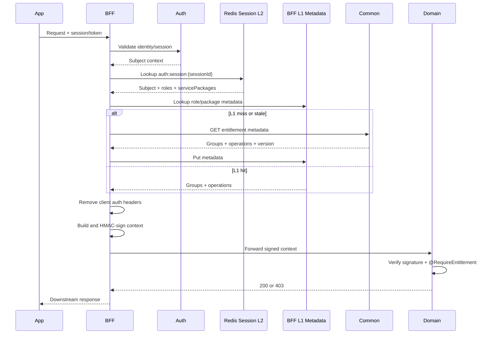

# Entitlement Enrichment Implementation Plan

## 1. Mục tiêu

Khi request đi qua BFF, BFF phải lấy entitlement mới nhất của subject, tạo authorization context tin cậy, ký context và forward xuống domain. Domain chỉ đọc `AuthContext` đã được sharedpackage verify; client không thể tự gửi hoặc sửa entitlement header.

```text
App/Portal
  -> BFF authenticate session/token
  -> BFF resolve subject
  -> BFF lookup session in L2
  -> BFF lookup role/package metadata in L1
  -> BFF merge concrete operations
  -> BFF sign internal auth context
  -> Domain verify signature
  -> @RequireEntitlement authorize
```

## 2. Phạm vi

### Bao gồm

- Resolve entitlement bằng cách join role/service package trong L2 với metadata operation ở L1.
- Đọc metadata role/service package từ Common qua service discovery/HTTP client.
- Cache L1 trong từng BFF instance và L2 Redis.
- Forward `allow`, `deny`, `version`, `expiresAt` qua signed internal headers.
- Deny precedence và fail-closed cho API nhạy cảm.
- Invalidate cache khi entitlement thay đổi.
- Metrics, trace, audit log và API demo có `@RequireEntitlement`.

### Không bao gồm

- Business logic trong BFF.
- BFF tự tính package/group graph.
- Lưu entitlement trong database BFF.
- Kick session khi quyền thay đổi.

## 3. Mô hình cache chốt

### L1: entitlement metadata

L1 lưu metadata entitlement theo `servicePackage` hoặc `role`, không lưu dữ liệu user/session. Metadata gồm group và các operation cụ thể:

```json
{
  "servicePackage": "PREMIUM",
  "version": 12,
  "groups": [{"code": "PAYMENTS", "operations": ["PAYMENT", "TRANSFER"]}],
  "allow": ["PAYMENT", "TRANSFER"],
  "deny": [],
  "expiresAt": "2026-10-04T12:00:00Z"
}
```

```text
L1: bff:entitlement:metadata:package:{packageCode}:{version}
L1: bff:entitlement:metadata:role:{roleCode}:{version}
```

### L2: session authorization projection

L2 là session object do Auth phát hành. BFF lookup session bằng `sessionId` để lấy subject, role và service package; không cần lưu toàn bộ operation list trong session.

```json
{
  "sessionId": "sid-123",
  "subjectType": "CUSTOMER",
  "subjectId": "customer-001",
  "roles": ["CUSTOMER"],
  "servicePackages": ["PREMIUM"],
  "status": "ACTIVE",
  "idleExpiresAt": "2026-10-04T12:00:00Z",
  "absoluteExpiresAt": "2026-10-05T12:00:00Z"
}
```

```text
L2: auth:session:{sessionId}
```

Resolution:

```text
sessionId -> L2 session -> roles/servicePackages -> L1 metadata
           -> merge operations -> signed header -> domain annotation
```

## 4. Contract Common

BFF gọi qua downstream client tới Common để lấy metadata entitlement:

```http
GET /common/api/entitlements/metadata/packages/{packageCode}
GET /common/api/entitlements/metadata/roles/{roleCode}
```

Response chuẩn:

```json
{
  "success": true,
  "data": {
    "scopeType": "SERVICE_PACKAGE",
    "scopeId": "PREMIUM",
    "version": 12,
    "groups": [{"code": "PAYMENTS", "operations": ["PAYMENT", "TRANSFER"]}],
    "allow": ["ACCOUNT_VIEW", "TRANSFER"],
    "deny": ["TRANSFER_GLOBAL"],
    "expiresAt": "2026-10-04T12:00:00Z"
  }
}
```

Common là source of truth cho metadata. Common có thể materialize metadata từ package/group/override; BFF chỉ merge các metadata đã được trả về, không tự truy cập DB hoặc tự tính graph business.

## 5. BFF resolution flow

1. Xác thực mobile session hoặc portal token.
2. Lookup session projection trong L2 `auth:session:{sessionId}`.
3. Lấy subject, roles và service packages từ session.
4. Lookup metadata của từng role/service package trong L1.
5. L1 miss/stale thì gọi Common để lấy metadata rồi ghi lại L1.
6. Merge operation; deny luôn có precedence.
7. Xóa mọi entitlement header do client gửi.
8. Gắn operation list vào signed auth context.
9. Ký request và forward xuống domain.



## 5. Header contract

BFF creates and signs:

```http
X-Auth-Subject-Type: CUSTOMER
X-Auth-Subject-Id: customer-001
X-Auth-Entitlements: ACCOUNT_VIEW,TRANSFER
X-Auth-Entitlement-Deny: TRANSFER_GLOBAL
X-Auth-Entitlement-Version: 42
X-Auth-Entitlement-Expires-At: 2026-10-04T12:00:00Z
X-Auth-Timestamp: 2026-10-04T10:00:00Z
X-Auth-Nonce: <unique-value>
X-Auth-Signature: <hmac>
```

Client-supplied versions of these headers are always removed. The canonical signature includes method, request path, subject, entitlement lists, version, expiry, timestamp and nonce.

For a large entitlement list, phase two may replace lists with a signed reference:

```http
X-Auth-Entitlement-Ref: entitlement:subject:CUSTOMER:customer-001:42
```

Domain must still verify the reference/version against a trusted resolver; it must not trust a raw client-provided reference.

## 7. Cache and invalidation

Keys:

```text
L1: bff:entitlement:metadata:package:{packageCode}:{version}
L1: bff:entitlement:metadata:role:{roleCode}:{version}
L2: auth:session:{sessionId}
```

Rules:

- L1 metadata TTL short, for example 30-60 seconds, and version-aware.
- L2 session TTL follows idle and absolute session expiry.
- Newer metadata version replaces older version only.
- Never serve expired metadata for sensitive operations.
- Entitlement changes do not revoke sessions.
- Common publishes `ENTITLEMENT_METADATA_CHANGED` through Redis/Kafka.
- Every BFF instance invalidates affected role/package metadata in L1.
- A service package change invalidates one metadata entry, not every user session.

## 8. Failure policy

| Situation | Non-sensitive API | Sensitive API |
|---|---|---|
| Snapshot not found | `403 ENTITLEMENT_DENIED` | `403 ENTITLEMENT_DENIED` |
| Common unavailable | configurable `503` | fail closed, `503` or `403` |
| Snapshot expired | refresh once | reject |
| Invalid signature downstream | `401` | `401` |
| Missing operation | `403` | `403` |

BFF must not silently grant access when Common, Redis or snapshot validation fails.

## 9. Implementation steps

## 10. Trạng thái triển khai hiện tại

### Đã triển khai

- Common materializes metadata cho service package từ package/group/operation bindings.
- Common expose `GET /entitlements/admin/metadata/packages/{code}`.
- Auth session projection có `roles` và `servicePackages`, được lưu trong Redis session JSON.
- Onboarding gán package mặc định `STANDARD`, bind Keycloak subject với internal `customerId`, rồi cập nhật session hiện tại.
- Các lần login sau Auth resolve `customerId` từ identity link và hydrate package từ Common; Keycloak không lưu phân quyền.
- BFF introspect session, cache metadata package ở L1 in-memory với TTL 60 giây, merge operation và deny precedence.
- BFF ký internal auth headers theo downstream path thực tế trước khi forward.
- Sharedpackage verify HMAC signature và hỗ trợ `@RequireEntitlement`.
- Client demo có endpoint `GET /shared-test/entitlement/test2` yêu cầu operation `TEST2`.
- Đã smoke test qua BFF với kết quả `200` khi được cấp `TEST2`; package `STANDARD` chưa có operation nên trả `403` đúng thiết kế.

### Giới hạn cần xử lý ở phase tiếp theo

- Role metadata và user override chưa được đưa vào resolver BFF.
- L1 hiện là cache cục bộ trong từng BFF instance; chưa có event invalidation Redis/Kafka giữa nhiều instance.
- Common metadata endpoint đang dùng admin key nội bộ cho smoke test; production nên thay bằng internal service authentication.

### Step 1: sharedpackage contract

- Add immutable entitlement metadata/session projection model.
- Add `AuthContext` fields for allow, deny, version and expiry.
- Add canonical header constants.
- Include entitlement fields in `AuthHeaderSigner` and verifier.
- Extend `@RequireEntitlement` to deny when the requested operation is in deny list.
- Add tests for `ANY`, `ALL`, deny precedence, expired snapshot and missing context.

### Step 2: Common source API

- Add `GET /entitlements/metadata/packages/{code}`.
- Add `GET /entitlements/metadata/roles/{code}`.
- Add explicit metadata validation and version response.
- Add materialization/rebuild use case from package/group/override.
- Publish entitlement change event after committed writes.
- Add audit records and metrics for rebuild/publish.

### Step 3: BFF resolver

- Add `EntitlementResolver` port.
- Add Common HTTP adapter cho metadata role/service package.
- Đọc session projection từ Auth Redis L2.
- Add L1 metadata cache; không copy toàn bộ operation list vào session.
- Add single-flight protection for concurrent metadata misses.
- Add request filter integration after session/token authentication.
- Strip spoofable headers before signing.

### Step 4: domain enforcement

- Add `@RequireEntitlement("TRANSFER")` to one demo endpoint.
- Verify signed context in sharedpackage.
- Return `403` with `ENTITLEMENT_DENIED`.
- Add trace attributes and metrics for allow/deny/cache hit/cache miss.

### Step 5: portal test workflow

- Create operation, group and package.
- Bind operation to group and group to package.
- Assign package to customer.
- Rebuild/upsert snapshot.
- Login as the customer through BFF.
- Call protected endpoint and inspect `200` or `403`.
- Change package, wait for/invoke invalidation, call again without logging out.

## 10. Acceptance criteria

- Client cannot grant itself an entitlement by sending headers.
- BFF forwards a valid signed entitlement context on every authenticated downstream request.
- Domain returns `200` for an allowed operation.
- Domain returns `403` for denied/missing operation.
- Expired/stale snapshot is not accepted for sensitive APIs.
- Cache hit does not call Common.
- Entitlement update invalidates L1 on all BFF instances.
- Trace ID remains identical across BFF, Common and Domain logs.
- Metrics expose resolver latency, cache hit/miss, Common errors and authorization decisions.

## 11. Test matrix

| Case | Expected |
|---|---|
| Allow contains `TRANSFER` | `200` |
| Allow missing `TRANSFER` | `403` |
| Deny contains `TRANSFER` | `403` |
| Invalid HMAC | `401` |
| Expired snapshot | `403` or controlled `503` |
| Redis down, sensitive API | fail closed |
| Updated version after cache invalidation | new decision without logout |
| Spoofed `X-Auth-Entitlements` from app | ignored/rejected |
