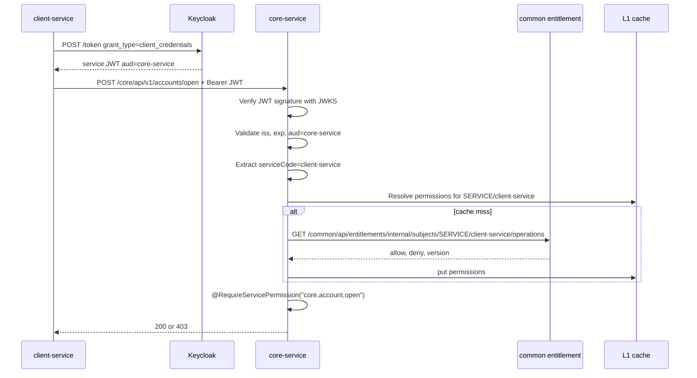

# Service-to-Service Authorization Implementation Plan

## 1. Goal

Build an authentication and authorization mechanism between internal services in a like-prod direction:

```text
Service caller
  -> obtains a service access token from Keycloak using client_credentials
  -> calls downstream with Authorization: Bearer <service-token>
  -> downstream verifies the JWT using Keycloak JWKS
  -> downstream extracts serviceCode from the token
  -> @RequireServicePermission checks whether serviceCode is allowed to perform the operation
```

The token is used to prove **which service is calling**. Common entitlement is used to decide **which operations that service may call**.

Do not trust service permissions if they are only passed through a plain header such as `X-Service-Entitlement`.

## 2. Scope

### Included

- Outbound service token for HTTP clients in `sharedpackage`.
- Outbound service token for gRPC clients in `sharedpackage`.
- Inbound JWT Resource Server for HTTP domain services.
- Inbound JWT verification for the gRPC server interceptor.
- Annotation `@RequireServicePermission`.
- Service permission resolver lookup for entitlement from Common/cache.
- Keycloak client credentials configuration for each service.
- First-phase application to `client-service -> core-service` account opening and Common entitlement resolve.
- Logs, metrics, traces, and standardized errors.

### Not Included in the First Phase

- mTLS/service mesh.
- Dynamic token exchange for user delegation.
- Production secret management through Vault/KMS.
- Service permissions by tenant.
- Realtime token kick/revoke when entitlement changes.

## 3. Design Principles

- Each service has its own identity: `client-service`, `core-service`, `common-service`, `auth-service`, `bff-service`, `t29-service`.
- Workers/jobs use the identity of the service that contains them, for example a worker in `common` uses `common-service`.
- The private key that signs JWTs exists only in Keycloak. Services only verify tokens using the public key from JWKS.
- Downstream services must validate `issuer`, `signature`, `exp`, `audience`, `caller`.
- Do not use a shared secret such as `X-Internal-Core-Secret` for the new flow. Internal endpoints must use a service token.
- The Keycloak client secret is read from an env var; do not store the real secret in git.
- Service permissions are not read from a header sent by the caller itself.

User context and service identity are two different layers:

```http
Authorization: Bearer <service-token>
X-Auth-Subject-Id: customer-001
X-Auth-Entitlements: ACCOUNT_VIEW,ACCOUNT_OPEN
X-Auth-Signature: ...
traceparent: 00-...
```

`Authorization` answers "which service is calling". `X-Auth-*` answers "which subject is being acted on behalf of" and must be a signed context created by BFF/sharedpackage.

Service permission and user entitlement are checked independently:

```text
@RequireServicePermission = whether the caller service may call the operation on the target service
@RequireEntitlement       = whether the user/customer has the business permission
```

An endpoint checks whichever annotations it has. If both annotations are present, both must pass. Internal/system endpoints without user context use only `@RequireServicePermission`.

## 4. Runtime Flow



## 5. Keycloak Setup

Create a confidential client for each service:

```text
client-service
core-service
common-service
auth-service
bff-service
t29-service
```

Each client needs:

```text
Access type: confidential
Service accounts enabled: true
Client authentication: enabled
Grant type: client_credentials
```

Expected token:

```json
{
  "iss": "http://keycloak:8080/realms/truongsonbank",
  "sub": "service-account-client-service",
  "azp": "client-service",
  "aud": ["core-service"],
  "exp": 1790000000,
  "iat": 1789999700,
  "jti": "token-id"
}
```

Use strict audience by downstream:

```text
client-service -> core-service   => token aud = core-service
bff-service    -> core-service   => token aud = core-service
core-service   -> t29-service    => token aud = t29-service
```

If `aud` does not contain the target service yet, configure a Keycloak audience mapper for each client/downstream pair.

First-phase service credentials use `client_id + client_secret`. Production hardening can upgrade this to `private_key_jwt` or mTLS client authentication.

## 6. Sharedpackage Inbound Module

### 6.1 Configuration

```yaml
tsb:
  security:
    service-auth:
      enabled: true
      service-code: core-service
      issuer-uri: http://keycloak:8080/realms/truongsonbank
      jwk-set-uri: http://keycloak:8080/realms/truongsonbank/protocol/openid-connect/certs
      expected-audience: core-service
      principal-claims: azp,client_id,sub
      permission-resolver:
        fail-policy: closed
      cache:
        permissions-ttl: 60s
```

If using Spring Security Resource Server:

```yaml
spring:
  security:
    oauth2:
      resourceserver:
        jwt:
          issuer-uri: http://keycloak:8080/realms/truongsonbank
```

Spring/Nimbus automatically caches JWKS and refreshes it when it sees a new `kid`.

### 6.2 Classes to Add

```text
sharedpackage/src/main/java/vn/com/truongsonbank/shared/security/service/
  ServiceAuthProperties.java
  ServicePrincipal.java
  ServiceSecurityContext.java
  ServiceJwtExtractor.java
  ServicePermissionResolver.java
  CommonServicePermissionClient.java
  ServicePermissionCache.java
  RequireServicePermission.java
  RequireServicePermissionAspect.java
  ServiceAuthAutoConfiguration.java
```

### 6.3 ServicePrincipal

```json
{
  "serviceCode": "client-service",
  "subject": "service-account-client-service",
  "audiences": ["core-service"],
  "issuer": "http://keycloak:8080/realms/truongsonbank",
  "tokenId": "jti",
  "expiresAt": "2026-10-04T12:00:00Z"
}
```

The canonical `serviceCode` is `azp`. Fallback order is `client_id`, then `sub`.

### 6.4 Annotation Validator

The annotation is placed by default on the controller/inbound adapter:

```java
@PostMapping("/accounts/open")
@RequireServicePermission("core.account.open")
public OpenAccountResponse open(...) {
    ...
}
```

Aspect processing:

```text
1. Read Jwt from SecurityContext.
2. Extract serviceCode using azp -> client_id -> sub.
3. Check that audience contains the current service.
4. Resolve operations for serviceCode from cache/Common.
5. Apply DENY > ALLOW > default deny.
6. If the operation does not exist, return 403 SERVICE_PERMISSION_DENIED.
```

If permissions cannot be resolved from cache/Common, fail closed with `503 SERVICE_PERMISSION_UNAVAILABLE`.

## 7. Sharedpackage Outbound Module

### 7.1 Downstream Configuration

Outbound service-auth is enabled by downstream/route, not globally. The default should be disabled to avoid sending internal tokens to external providers.

```yaml
tsb:
  protocol:
    downstreams:
      core:
        base-url: http://core:8085
        service-auth:
          enabled: true
          client-id: client-service
          client-secret: ${CLIENT_SERVICE_SECRET}
          token-uri: http://keycloak:8080/realms/truongsonbank/protocol/openid-connect/token
          audience: core-service
          token-refresh-skew: 30s
          retry-on-unauthorized-once: true
      public-ekyc:
        base-url: https://external-ekyc.example
        service-auth:
          enabled: false
```

### 7.2 Classes to Add

```text
sharedpackage/src/main/java/vn/com/truongsonbank/shared/protocol/security/
  ServiceTokenManager.java
  KeycloakClientCredentialsClient.java
  ServiceTokenCache.java
  ServiceAuthHttpRequestInterceptor.java
  ServiceAuthGrpcClientInterceptor.java
  ServiceAuthGrpcServerInterceptor.java
```

### 7.3 HTTP Outbound Flow

```text
HTTP client call
  -> resolve downstream policy
  -> service-auth enabled?
  -> ServiceTokenManager.getToken(clientId, audience)
  -> cache hit and not near expiry: reuse
  -> cache miss/near expiry: request Keycloak token
  -> attach Authorization: Bearer <token>
```

If downstream returns `401` because of the token, the interceptor refreshes the token and retries exactly once. Do not retry many times to avoid a retry storm.

Existing user context headers still travel through the signed internal auth context; they are not mixed into the service token.

### 7.4 gRPC Flow

The gRPC client interceptor attaches the service token through metadata:

```text
authorization: Bearer <service-token>
```

gRPC server interceptor:

```text
1. Read authorization metadata.
2. Verify JWT using JWKS.
3. Validate issuer, exp, audience.
4. Extract serviceCode.
5. Put ServicePrincipal into context.
6. Method implementation/aspect checks @RequireServicePermission.
```

HTTP and gRPC share `ServiceTokenManager`, `ServiceJwtExtractor`, `ServicePermissionResolver`, and error semantics.

## 8. BFF Behavior

BFF is also a service caller and has no exception. When BFF forwards a request to a domain endpoint with `@RequireServicePermission`, BFF must obtain a service token with identity `bff-service`.

Request from BFF to Core:

```http
Authorization: Bearer <JWT of bff-service, aud=core-service>
X-Auth-Subject-Id: customer-001
X-Auth-Customer-Id: customer-001
X-Auth-Entitlements: ACCOUNT_VIEW,ACCOUNT_BALANCE_VIEW
X-Auth-Timestamp: ...
X-Auth-Nonce: ...
X-Auth-Signature: ...
traceparent: ...
```

Domain behavior:

```text
1. Verify Authorization JWT.
2. Extract callerService = bff-service.
3. Check @RequireServicePermission against SERVICE/bff-service.
4. If the endpoint has @RequireEntitlement, verify the signed X-Auth-* context and check user entitlement.
5. Run business logic.
```

With BFF Spring Cloud Gateway, the service token should be attached by GatewayFilter by route:

```yaml
tsb:
  gateway:
    routes:
      core:
        path: /bff/api/core/**
        target-service: core-service
        service-auth:
          enabled: true
          audience: core-service
      keycloak:
        path: /bff/api/keycloak/**
        service-auth:
          enabled: false
```

Routes that need a token must enable it explicitly. Routes to Keycloak or external providers do not automatically attach a service token.

## 9. Common Entitlement Contract

Add an internal API for services to resolve permissions:

```http
GET /common/api/entitlements/internal/subjects/{subjectType}/{subjectCode}/operations
```

Example:

```http
GET /common/api/entitlements/internal/subjects/SERVICE/client-service/operations
```

Response:

```json
{
  "subjectType": "SERVICE",
  "subjectCode": "client-service",
  "version": 7,
  "allow": [
    "core.account.open",
    "core.customer.link"
  ],
  "deny": [],
  "expiresAt": "2026-10-04T12:00:00Z"
}
```

Common still owns the entitlement DB in schema/database `entitlementdb`. Other services are not allowed to connect directly to Common's DB.

This API is also protected by service auth. To avoid a resolver loop, Common directly queries DB `entitlementdb` to check whether the caller has `common.entitlement.resolve`; it does not call back into its own resolver API.

In the first phase, only grant `common.entitlement.resolve` to services that really need to resolve permissions.

## 10. DB Entitlement for Services

Reuse the existing entitlement model.

Decision for the first phase: use the existing `principal_entitlement_group` table:

```text
principal_type = SERVICE
principal_id = client-service
group_id = CLIENT_SERVICE_GROUP
effect = ALLOW
```

Operation naming:

```text
<target-service>.<domain>.<action>
```

Examples:

```text
core.account.open
core.account.read
common.entitlement.resolve
common.config.read
t29.account.open
t29.account.balance
```

Permission decisions use DENY precedence:

```text
DENY > ALLOW > default deny
```

The Common resolve API returns `allow`, `deny`, and `version`; the service resolver applies precedence itself.

## 11. Cache, Invalidation, and Latency

Cache key:

```text
service-permission:SERVICE:{serviceCode}
```

L1:

```text
ConcurrentHashMap/Caffeine inside each service
TTL 30-60s
```

The first phase uses only local L1 + short TTL. Common is the source of truth.

Invalidation event through Redis pub/sub:

```json
{
  "eventType": "SERVICE_ENTITLEMENT_CHANGED",
  "subjectType": "SERVICE",
  "subjectCode": "client-service",
  "version": 8
}
```

Services subscribe to the event and evict the corresponding L1 entry. If permissions cannot be resolved after eviction, fail closed.

Reducing overhead/latency:

```text
Outbound token:
  - Cache token by (clientId, audience).
  - Do not call Keycloak on every request.
  - Refresh before expiry using token-refresh-skew.
  - If 401, refresh and retry exactly once.
  - Use a single-flight lock per (clientId, audience) to avoid many threads fetching a token at the same time.

Inbound JWT:
  - JWKS public key is cached by Spring/Nimbus by kid.
  - Hot requests verify the signature locally and do not call Keycloak.

Permission:
  - Local L1 cache by serviceCode.
  - Redis pub/sub invalidation so the TTL does not need to be too short.
  - Optionally warm up tokens/permissions for popular downstreams at startup.
```

Latency targets:

```text
Token cache hit: < 1ms
Permission L1 hit: < 1ms
JWT verify local: around 1-3ms depending on environment
Token cache miss: depends on Keycloak
Permission cache miss: depends on Common
```

## 12. Error Contract

```text
SERVICE_TOKEN_REQUIRED          401 Missing Authorization bearer token
SERVICE_TOKEN_INVALID           401 JWT invalid or expired
SERVICE_AUDIENCE_INVALID        403 Token audience does not include current service
SERVICE_PRINCIPAL_INVALID       403 Cannot extract serviceCode
SERVICE_PERMISSION_DENIED       403 Caller service lacks required operation
SERVICE_PERMISSION_UNAVAILABLE  503 Cannot resolve service permissions
SERVICE_TOKEN_FETCH_FAILED      503 Caller cannot get downstream service token
```

Responses still go through the sharedpackage response wrapper:

```json
{
  "success": false,
  "code": "SERVICE_PERMISSION_DENIED",
  "message": "Service is not allowed to perform this operation",
  "traceId": "..."
}
```

## 13. Observability

Metrics:

```text
tsb.service.token.get.duration
tsb.service.token.fetch.duration
tsb.service.token.cache.hit
tsb.service.permission.resolve.duration
tsb.service.permission.cache.hit
tsb.service.authorization.check.duration
tsb.service.authorization.decision
```

Logs:

```json
{
  "event": "service_auth_decision",
  "callerService": "client-service",
  "targetService": "core-service",
  "operation": "core.account.open",
  "decision": "ALLOW",
  "traceId": "..."
}
```

Do not log tokens, client secrets, or the raw Authorization header.

Trace:

```text
Span: service-token.fetch
Span: service-permission.resolve
Span attribute: caller.service, target.service, required.operation, decision
```

## 14. Apply to Core Account

Open account moves directly to service tokens, without keeping the shared secret fallback:

```java
@PostMapping("/core/api/v1/accounts/open")
@RequireServicePermission("core.account.open")
public OpenAccountResponse openAccount(@RequestBody OpenAccountRequest request) {
    ...
}
```

Refactor:

```text
client onboarding
  -> call core via TsbHttpClientFactory
  -> outbound interceptor attach service token for audience core-service
  -> core validates token + service permission
```

`X-Internal-Core-Secret` and the related shared-secret validation must be removed from this flow.

## 15. Implementation Order

### Phase 1: Foundation

1. Add Spring Security OAuth2 Resource Server dependencies to `sharedpackage`.
2. Add `ServiceAuthProperties`.
3. Add JWT extractor and service principal model.
4. Add `@RequireServicePermission` + aspect.
5. Add error codes/messages.
6. Add HTTP and gRPC inbound verification.

### Phase 2: Common Entitlement Lookup

1. Use `principal_entitlement_group` with `principal_type=SERVICE`.
2. Add the internal resolve operations API.
3. The Common permission resolve endpoint checks `common.entitlement.resolve` directly in the DB.
4. Seed service principal/group/operation for:

```text
client-service -> core.account.open, common.entitlement.resolve
bff-service    -> core.account.read, common.entitlement.resolve, common.config.read
core-service   -> t29.account.open, t29.account.balance, common.entitlement.resolve
```

5. Add audit logs for service permission changes.

### Phase 3: Outbound Service Token

1. Add the Keycloak client credentials client.
2. Add token cache by `(clientId, audience)`.
3. Integrate into `TsbProtocolClientHttpRequestInterceptor`.
4. Integrate into the gRPC client interceptor.
5. Add downstream service-auth config.
6. Add single-flight token fetch and retry-on-401 exactly once.

### Phase 4: Apply Service

1. Apply to `core /accounts/open`.
2. Configure `client` to obtain a token when calling `core`.
3. Configure `core` to verify token audience `core-service`.
4. Remove the shared secret from the `accounts/open` flow.
5. Apply service token GatewayFilter for internal BFF routes that need to call domain services.

### Phase 5: Invalidation and Hardening

1. Publish `SERVICE_ENTITLEMENT_CHANGED`.
2. Consumer evicts L1 in services.
3. Add token/permission warm-up if needed.
4. Add a Grafana dashboard.

## 16. Test Plan

### Positive

```text
client-service has core.account.open
POST /core/api/v1/accounts/open
Expected: 200
```

### Missing Token

```text
No Authorization
Expected: 401 SERVICE_TOKEN_REQUIRED
```

### Invalid Token

```text
Bearer malformed-token
Expected: 401 SERVICE_TOKEN_INVALID
```

### Wrong Audience

```text
Token aud=common-service, request core-service
Expected: 403 SERVICE_AUDIENCE_INVALID
```

### Missing Permission

```text
client-service does not have core.account.open
Expected: 403 SERVICE_PERMISSION_DENIED
```

### Cache Invalidation

```text
1. Grant core.account.open -> request 200
2. Revoke core.account.open in Common
3. Publish invalidation event
4. Request again
Expected: 403 after eviction
```

### BFF to Domain

```text
bff-service has core.account.read
customer has ACCOUNT_VIEW
GET /bff/api/core/accounts/{accountNumber}
Expected: 200
```

```text
bff-service lacks core.account.read
customer has ACCOUNT_VIEW
Expected: 403 SERVICE_PERMISSION_DENIED
```

```text
bff-service has core.account.read
customer lacks ACCOUNT_VIEW
Expected: 403 ENTITLEMENT_DENIED
```

### gRPC

```text
authorization metadata contains token aud=target-service
Expected: server interceptor set ServicePrincipal and method passes permission check
```

### Token Cache

```text
1. Call downstream 10 times
2. Keycloak token endpoint should be called once or very few times
3. Metrics token cache hit increases
```

## 17. Planned Curl Smoke

Get token:

```bash
curl -sS -X POST 'http://localhost:8088/realms/truongsonbank/protocol/openid-connect/token' \
  -H 'Content-Type: application/x-www-form-urlencoded' \
  -d 'grant_type=client_credentials' \
  -d 'client_id=client-service' \
  -d 'client_secret=local-client-service-secret'
```

Call Core:

```bash
TOKEN='...'

curl -sS -X POST 'http://localhost:8085/core/api/v1/accounts/open' \
  -H "Authorization: Bearer $TOKEN" \
  -H 'Content-Type: application/json' \
  -H 'X-Idempotency-Key: service-auth-smoke-1' \
  -d '{
    "customerId": "customer-smoke-1",
    "phoneHash": "phone-hash",
    "cccdHash": "cccd-hash",
    "cccd": "012345678901",
    "fullName": "NGUYEN VAN A",
    "currency": "VND"
  }'
```

## 18. Finalized Decisions

```text
DB model: principal_entitlement_group with principal_type=SERVICE.
Audience: strict per downstream service.
Check mode: endpoint checks whichever annotations are present; both means AND.
Failure policy: fail closed.
Protocols: HTTP + gRPC in first phase.
Credential: client_id + client_secret from env var.
Cache: L1 local TTL short + Redis pub/sub invalidation.
Annotation placement: controller/adapter inbound.
Operation naming: <target-service>.<domain>.<action>.
InternalAuth HMAC: kept only for signed user/auth context, not service caller authentication.
BFF identity: bff-service.
Worker identity: identity of containing service.
Common resolve endpoint: protected by service auth and direct DB check.
Token refresh: refresh before expiry; retry once after 401.
Permission precedence: DENY > ALLOW > default deny.
serviceCode claim: azp, fallback client_id, fallback sub.
gRPC metadata: authorization: Bearer <token>.
Common response: allow, deny, version.
Initial apply: core.account.open and common.entitlement.resolve.
Shared secret: removed, no backward compatibility.
```

## 19. Finalized Decisions During Implementation

- The local realm has audience mappers for the flows `client-service -> core-service`, `client-service -> common-service`, and `bff-service -> core/common-service`.
- Service token lifetime is decided by Keycloak; the client refreshes before expiry according to `token-refresh-skew`, currently defaulting to 30 seconds.
- First-phase service permissions are seeded/migrated through `entitlement_snapshot`; the service permission admin portal is a later extension.

## 20. Definition of Done

- Services calling other services do not use a shared secret.
- Downstream verifies JWT through JWKS and fails closed when the token is missing/invalid.
- `@RequireServicePermission` works independently from `@RequireEntitlement`.
- Common is the source of truth for service permissions.
- Permission changes are invalidated through Redis pub/sub and expire through a short TTL.
- HTTP and gRPC both have outbound/inbound service auth.
- Internal BFF routes can automatically attach service tokens by downstream config.
- There are curl tests for 200/401/403.
- Metrics/logs/traces exist to debug authorization decisions.

## 21. Current Implementation Status

- `sharedpackage` already has `ServiceTokenManager`, JWT/JWKS verification, `@RequireServicePermission`, HTTP interceptor, and gRPC interceptor.
- `common` already exposes the internal resolver for service permissions and publishes Redis events when the entitlement snapshot changes.
- `core` already protects operation `core.account.open` with a service token and permission `core.account.open`.
- `client` already calls `core` using a `client-service` token; it no longer uses a shared secret to authenticate the service caller.
- `bff` already forwards the `bff-service` token by downstream audience (`common-service`, `core-service`) when forwarding a request with a valid session. The token is cached and refreshed automatically before expiry.
- Runtime currently uses `entitlement_snapshot` as the read source for service caller permissions. The principal/group tables in the target model section remain an admin extension step and are not used in this runtime path yet.
- BFF still keeps HMAC signed user-context to transmit user context; this HMAC does not replace the service token.
